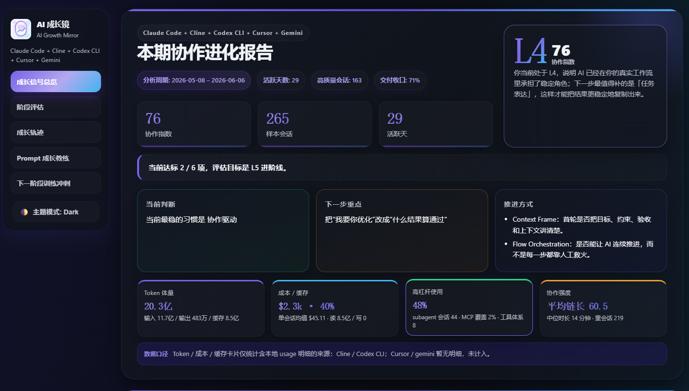
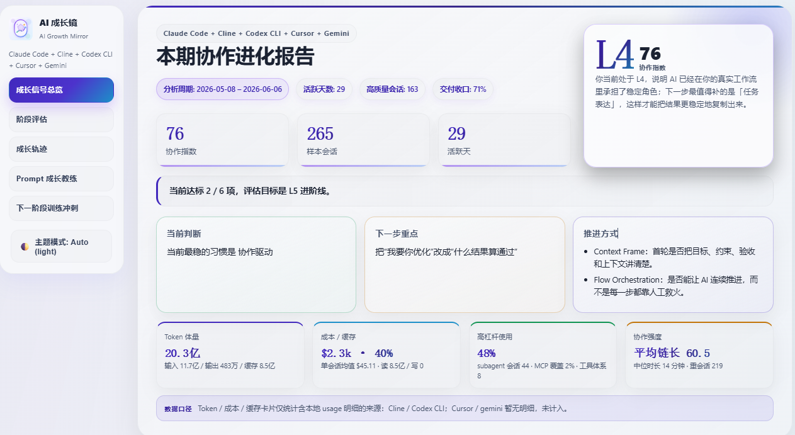
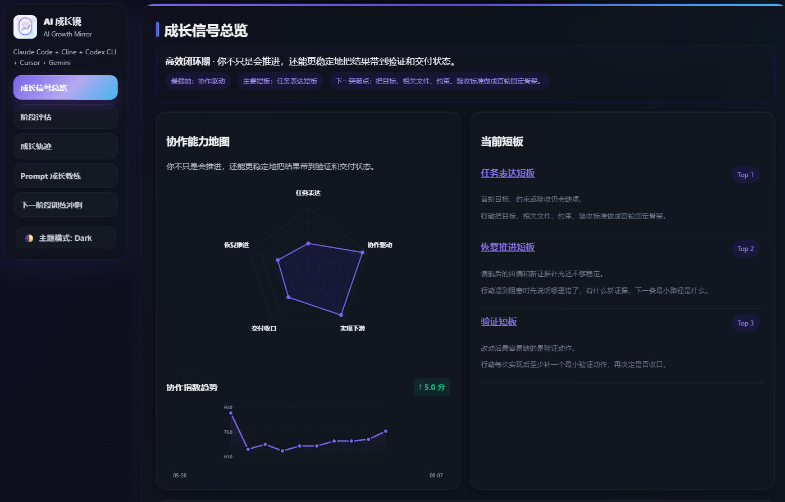
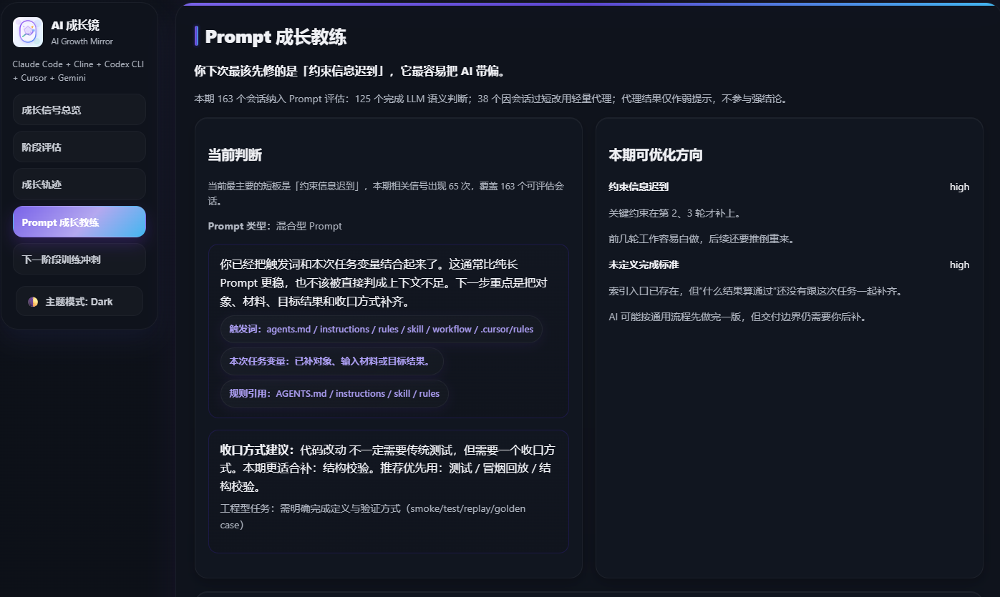
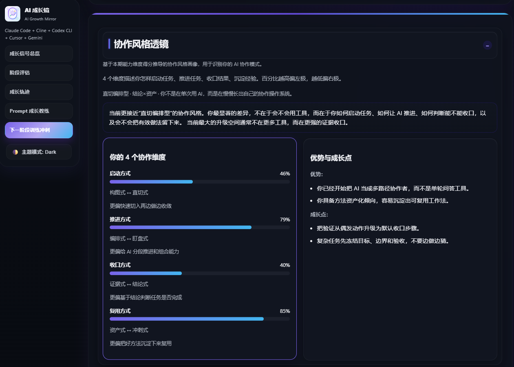
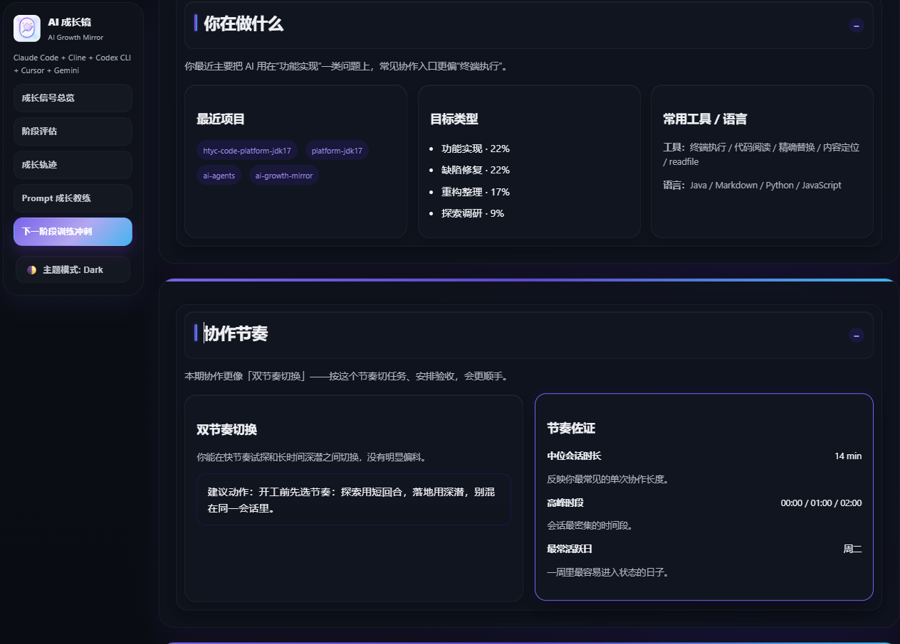
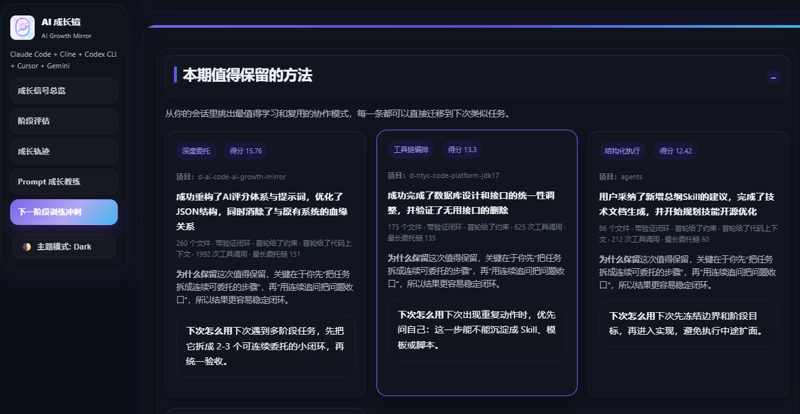

# AI Growth Mirror (AI 协作成长镜)

[](./ai_growth_mirror/domain/cache_schema.py)
[](./pyproject.toml)
[](./LICENSE)

> **你是否每天都在大量使用 Cursor、Claude Code、Trae 等 AI 编码工具，却感觉交付结果不稳定？或者经常被 AI 牵着走，不知道协作的问题到底出在哪里？**
>
> **AI Growth Mirror** 是一面**本地优先**的个人 AI 协作能力反思镜。它静默、安全地读取你本机已有的 AI 编码会话历史，通过“四证法”和“五轴底盘”算法，将你模糊的协作感觉转化为**可观察、可解释、可复盘**的可视化成长报告。它不是一张“好看的 AI 使用海报”，而是帮你打破协作瓶颈、沉淀高杠杆技术资产的成长产品。

---

## 🎯 评估方法论：“四证法”

AI Growth Mirror 拒绝无意义的单纯统计（如消息数、敲代码行数），而是用**“四证法”**真实映射你的人机协作水平：

* 🎯 **Context Frame (上下文边界)**: 首轮是否把目标、约束、验收和代码上下文讲透？
* 🔗 **Flow Orchestration (连续流编排)**: 是否驱策 AI 连续解决复杂问题，而不是每一步都靠人工接管？
* 🔁 **Proof Loop (闭环验证)**: 是否把构建、测试与纠偏行为深度融入人机交互中？
* 📦 **Method Asset (方法资产化)**: 是否将有效的实践提炼为 Rule、Skill、Workflow 等高杠杆资产并产生复用？

---

## 📈 五轴协作雷达

每一期生成的评估结果都会投射到以下**五轴协作雷达**（协作指数由此计算）：

| 协作能力轴 (2026 核心) | 权重 | 衡量内容 |
|---------------------|:---:|----------|
| **任务表达** (`intent_clarity`) | 20% | 提示词约束前置、代码上下文提供以及边界清晰度 |
| **协作驱动** (`execution_driving`) | 22% | 自主工具链解决长度、子代理编排与人机协作节奏 |
| **实现下潜** (`implementation_depth`) | 22% | 文件修改量、代码验证覆盖率与实现边界控制 |
| **交付收口** (`delivery_closure`) | 22% | 任务完成率、验证行为率与测试用例运行表现 |
| **恢复推进** (`adaptive_recovery`) | 14% | AI 偏航或报错时，人机纠偏和回到正轨的质量 |

---

## ✨ 核心亮点 (v1.2 架构升级)

### 1. 🏎️ 惰性解析与采样匹配 (Lazy Parsing Placeholder)
针对海量会话日志（数万条历史），系统引入了 **Lazy Placeholder** 扫描机制。扫描阶段仅加载轻量级代理结构进行项目过滤。在 Orchestrator 完成过滤和抽样限制后，仅对最终进入报告的 session 执行 `ensure_parsed` 深度解析，让海量日志的加载性能直升近百倍。

### 2. ⚖️ 缺失指标动态归一化 (Scorer Normalization)
Cursor、Trae、QCoder 等工具的日志天然缺少 Token 用量明细。系统独创了**缺失型指标归一化**算法：当没有 Token 统计数据时，自动将 Token 计分（18%权重）从加权求和中剔除，其余子维度（验证率、修改量等）权重动态等比扩重，杜绝不合理的 0 分惩罚。

### 3. 🔒 本地优先，绝对安全
100% 本地离线规则引擎分析。即使在 `llm` 模式下引入 LLM 语义诊断，也仅发送脱敏后的对话**会话摘要**，而非完整代码原文。运行 `generate --redact` 还可以自动脱敏 HTML 报告、Sidecar 与快照中的路径和代码隐私。

### 4. 🔁 稳定 DB Revision (防缓存颠簸)
针对多会话共用单数据库文件 `state.vscdb` 的工具，系统基于内容哈希比对，仅在 AI 历史对话、模型映射等关键 key 确实变化时判定缓存失效。折叠侧边栏、移动光标等 unrelated IDE 写入绝不会导致缓存发生大面积颠簸。

### 5. 🔌 9 款主流 AI 工具一键适配
一键扫描，自动识别并聚合以下 9 款 AI 工具：
- **国际主流**：Claude Code、Codex、Cursor、Gemini、Cline、Kilo Code
- **国产先锋**：CodeBuddy、Trae、QCoder

---

## 📊 报告效果预览

生成 `ai-growth-mirror.html` 后双击即可本地打开，无需部署。报告按「诊断 → 训练 → 追踪」组织，侧边栏可快速跳转各区块。

### 本期协作进化报告（Hero）

首屏一眼看懂：**等级 · 协作指数  · 下一步练什么**。支持浅色 / 深色主题切换。

| 浅色主题 | 深色主题 |
|:---:|:---:|
|  |  |

### 成长信号总览

五轴协作雷达 + 协作指数趋势折线 + Top 3 短板与可执行行动建议。



### Prompt 成长教练

基于真实会话的 Prompt 诊断：识别失败模式，并给出改写方向与收口建议。



### 协作风格透镜

四维度协作画像（启动 / 推进 / 收口 / 复用），帮你看见自己的 AI 协作「打法」而非只看分数。



### 工作聚焦与协作节奏

你在做什么（项目、目标类型、工具与语言）+ 双节奏切换等协作节律洞察。



### 本期值得保留的方法

从高分会话中提炼可复用的协作范式（深度委托、工具链编排、结构化执行），直接迁移到下一类相似任务。



---

## 🚀 快速开始

### 运行环境
- Python **3.12+**

### 1. 安装项目
```bash
# 克隆仓库后在根目录运行：
pip install -e .

# 如果需要使用 Anthropic/Gemini 服务提取 LLM 语义诊断和 Coach 建议：
pip install -e ".[llm]"
```

### 2. 初始化配置 (可选，用于 API Key 与资产足迹)
```bash
cp config.example.yaml config.yaml
# 编辑 config.yaml 填入 LLM Provider、API Key、本地 Agent 资产扫描根目录
```

### 3. 一键生成个人成长报告
```bash
# 1. 切换至您的任意开发工作区目录（通常为项目仓库根目录）
cd /path/to/your/project-workspace

# 2. 生成进化报告与成长快照
ai-growth-mirror generate
```

运行完成后，您的当前目录下将输出：
- `ai-growth-mirror.html`: 个人协作能力交互式分析主报告。
- `ai-growth-mirror.json`: 结构化 Sidecar 缓存数据（Schema v1.2 规范）。
- `ai-growth-mirror-share.html`: 对外分享脱敏卡片。
- `ai-growth-mirror-archive/`: 快照存档目录，第二次运行时将自动激活「成长轨迹对比」（本期 vs 上一期）。

---

## 🛠️ 进阶命令参数

* **指定工具过滤**：`ai-growth-mirror generate --tools cursor,trae`
* **锁定时间窗口**：`ai-growth-mirror generate --since 2026-01-01 --until 2026-06-30`
* **离线规则引擎分析**（零外部网络调用与费用）：`ai-growth-mirror generate --session-read-mode heuristic`
* **过滤分析范围**（按特定 Repository、目录或关键字过滤）：`ai-growth-mirror generate --repo app-repo --dir ~/projects/app`
* **手工对比历史快照**：`ai-growth-mirror compare <left_snapshot_id> <right_snapshot_id>`
* **清理过期缓存**：`ai-growth-mirror cache prune`

---

## 📖 开发者文档索引

对于想要深度定制、贡献 Adapter 或调试算法的开发者，请详细参阅我们的 Canonical 文档：
* [分层依赖与架构总纲](./docs/design/ARCHITECTURE_PRINCIPLES.md)
* [产品语气、命名与安全脱敏规范](./docs/design/AI_GROWTH_MIRROR_PERSONAL_DETAILED_DESIGN.md)
* [传播与分享飞轮设计](./docs/design/AI_GROWTH_MIRROR_OPEN_SOURCE_PROPAGATION_DESIGN.md)
* [参与贡献指南](./CONTRIBUTING.md)

---

## 许可证
本项目基于 [MIT License](./LICENSE) 协议发布。
