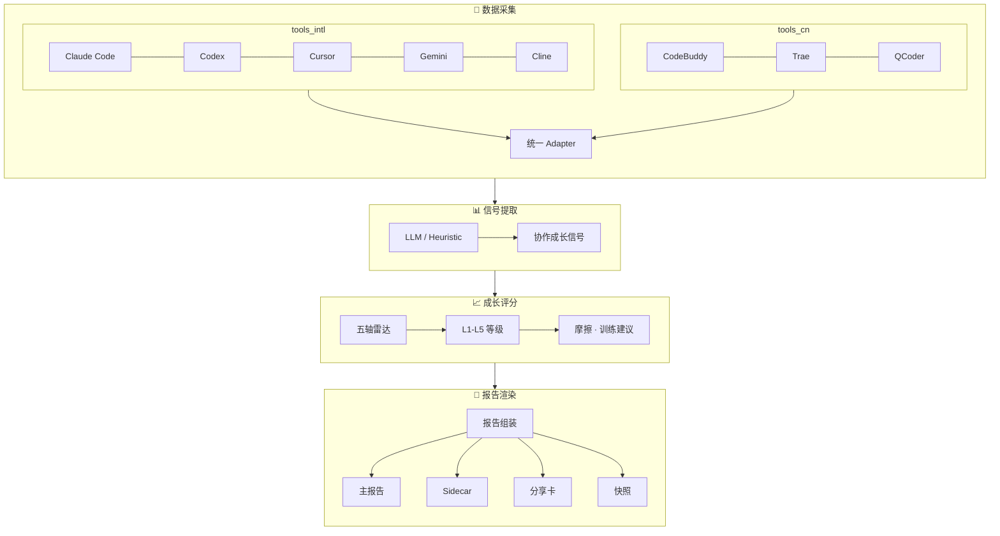
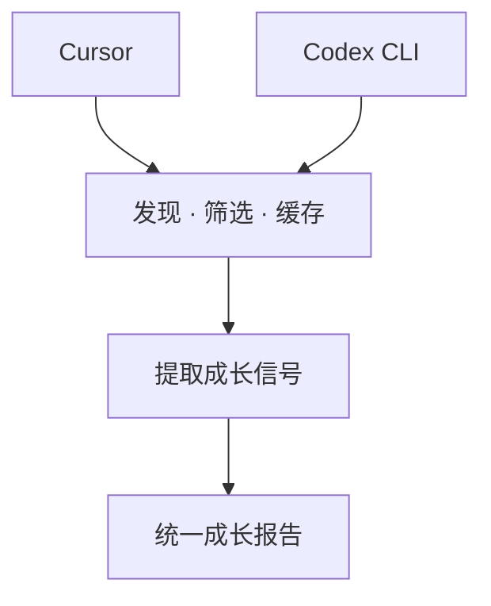
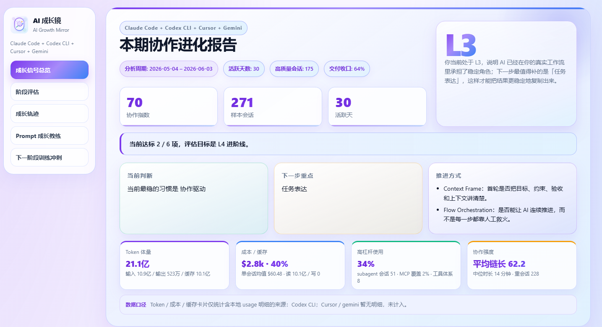
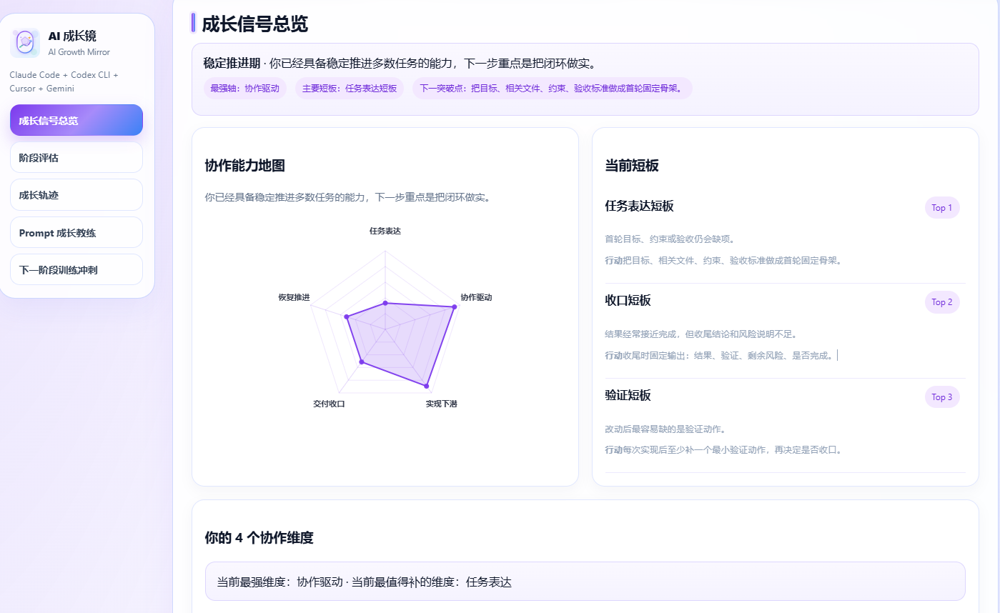

# AI Growth Mirror

**AI Growth Mirror**（个人成长镜）是一款**本地优先**的 AI 协作能力分析工具。从本机 AI 编码工具的日志目录读取历史会话（Cursor、Codex、Claude Code、Cline、Kilo Code、CodeBuddy、Trae、QCoder、Gemini 等 9 款），经统一适配、信号提取与五轴评分，生成可交互的个人成长报告。

> **核心目标**：帮 AI 编码用户看清自己的协作模式、摩擦瓶颈与资产化程度，明确下一步最值得投入的成长方向。

**工作区模型**：在你要**产出报告**的目录执行 CLI（通常是仓库根或项目根）。会话数据来自各工具默认路径（如 `~/.cursor/`、`~/.codex/`）；报告、快照、分析缓存写入**当前工作目录**，不会默认写到用户 home。本地产物已 `.gitignore`，不提交 git。

---

## 核心流程



### 流程说明

**Step 1 — 数据采集**：按 `--tools` 自动选取 Adapter，扫描本机日志目录。先轻量发现会话，再按需深度解析，结果缓存到工作区，重复运行更快。

**Step 2 — 信号提取**：`heuristic` 纯本地推导协作信号；`llm` 用 API Key 做语义深读。两种模式输出同一套成长信号（交付结果、Prompt 质量、摩擦点等）。

**Step 3 — 成长评分**：聚合全部会话，生成五轴雷达与 L1–L5 等级，定位摩擦根因，给出下一阶段训练冲刺建议。

**Step 4 — 报告渲染**：一键产出 HTML 主报告、JSON sidecar、对外分享卡，并归档快照——下次 generate 自动对比成长轨迹。

### 会话是怎么被读懂的？（以 Cursor / Codex 为例）

无论你日常用 **Cursor** 还是 **Codex CLI**，Growth Mirror 做的事一样：**静默读取本机已有日志，无需额外插件或上传完整对话**。其他工具（Claude Code、CodeBuddy、Trae 等）走同一套适配引擎，只是数据源路径不同。



**你能得到什么**：Cursor 侧优先用完整转录还原工具链与验证行为；Codex 侧额外解析 Token 用量，报告 Hero 可直接展示成本。两种数据源最终汇入**同一份成长报告**——换工具不用换评估标准。

### 一套引擎，读懂 9 款工具

Growth Mirror 为每款 AI 编码工具配备独立 Adapter，但对外体验一致：指定 `--tools all` 或按需勾选，其余交给 pipeline。

| 工具 | Adapter |
|------|---------|
| Claude Code | `ClaudeCodeSessionAdapter` |
| Codex | `CodexAdapter` |
| Cursor | `CursorAdapter` |
| Gemini | `GeminiAdapter` |
| CodeBuddy | `CodeBuddyAdapter` |
| Trae | `TraeAdapter` |
| QCoder | `QCoderAdapter` |

新增工具只需实现「发现会话 → 解析 → 标准化」三步，即可接入现有评分与报告链路。

---

## 产品概览

AI Growth Mirror 把分散在各 AI 编码工具里的会话历史，转成一份**可行动**的成长报告：不只统计用了多少次 AI，更回答「协作模式如何、卡在哪里、下一步练什么」。

### 界面预览

**本期协作进化报告（Hero）** — 协作指数、L3 等级、Token/成本口径与训练建议一览：



**成长信号总览** — 五轴雷达、短板排行与四维协作读数：



### 核心能力

| 能力 | 说明 |
|------|------|
| **多工具聚合** | 国际主流（Claude Code、Codex、Cursor、Gemini、Cline、Kilo Code）+ 国产（CodeBuddy、Trae、QCoder）共 9 款；`--tools all` 一次扫齐 |
| **双模式分析** | `heuristic` 纯本地规则（零外部调用）/ `llm` 语义深度分析（需 API Key）/ `auto` 按 Key 自动切换 |
| **五轴雷达评分** | 意图清晰度、执行驱动力、实施深度、交付闭环、适应恢复力 — 五个维度量化 AI 协作能力 |
| **L1–L5 成长等级** | 从初学者到专家，阶梯式评估，每个等级有具体行为描述；等级同时参考真实使用、工具编排、验证闭环和方法资产回流 |
| **个性化成长教练** | 只在有真实证据时生成改进建议、改写示例与下一问法；证据不足时明确留白，不用模板冒充你的当前状态 |
| **摩擦根因分析** | 区分用户可行动阻力、AI 能力边界与环境阻力，定位成长瓶颈 |
| **协作风格洞察** | 识别深度委托者、工具编排者、验证先行等高信号协作模式 |
| **成长轨迹对比** | 每次生成自动归档快照；报告内默认对比「本期 vs 上一期」，也可用 CLI 任意两期对比 |
| **资产足迹** | 可选扫描本地 skills、prompts、rules 等 Agent 资产；资产库存只做上下文，必须结合真实使用与复用信号解读 |
| **脱敏分享** | `--redact` 隐藏敏感信息，输出可对外分享的精简版报告 |
| **智能缓存** | mtime 增量缓存，相同会话不重复解析，重复运行更快 |
| **i18n** | 中英文双语，报告语言可切换 |

### 分析模式

| 模式 | 说明 | 隐私性 | API Key |
|------|------|--------|---------|
| **`auto`**（默认） | 有 Key → LLM session read + coaching；无 Key → heuristic | 自适应 | 可选 |
| **`heuristic`** | 基于会话元数据（工具链、文件修改、token 等）的规则引擎；coaching 仍可在有 Key 时调 LLM | 完全本地 | session read 不需要 |
| **`llm`** | 每会话 LLM 语义 session read，提取深度协作信号 | 摘要级上传 | 需要 |

建议先用 `heuristic` 或 `auto`（无 Key）验证 reader 接入，再开 `llm`。

### 成长等级

| 等级 | 分数 | 典型特征 |
|------|------|----------|
| **L1 · 初学者** | 0–37 | 刚接触 AI 编码，prompt 简短，以单次问答为主 |
| **L2 · 成长中** | 38–55 | 开始尝试多轮协作，偶尔使用工具调用 |
| **L3 · 较稳定** | 56–74 | 形成稳定协作节奏，能自主驱动中等复杂度任务 |
| **L4 · 高水平** | 75–89 | 擅长拆解复杂任务，熟练运用工具链和子代理 |
| **L5 · 专家** | 90–100 | 精通端到端 AI 协作，具备系统性资产建设能力 |

> 会话数 < 5 不评分；< 8 封顶 L3；< 15 封顶 L4。建议积累 15+ 个会话以获得稳定评分。

### 五轴雷达维度

| 维度 | 权重 | 衡量内容 |
|------|------|----------|
| **意图清晰度** | 20% | Prompt 的约束性、代码上下文丰富度、范围管理能力 |
| **执行驱动力** | 22% | 自主工具链长度、子代理使用、工具层级多样性 |
| **实施深度** | 22% | 文件修改量、token 消耗、代码验证率 |
| **交付闭环** | 22% | 任务完成率、验证行为率、测试运行率、git 提交率 |
| **适应恢复力** | 14% | 纠错质量、摩擦后的恢复速度、从失败中学习的能力 |

### CLI 命令一览

| 命令 | 用途 |
|------|------|
| `ai-growth-mirror generate` | 扫描会话 → 分析 → 生成成长报告 |
| `ai-growth-mirror compare <left> <right>` | 对比任意两期快照，可视化成长变化 |
| `ai-growth-mirror cache prune` | 清理过期缓存，释放磁盘空间 |

---

## 快速开始

### 环境

- Python **3.12+**

### 安装

```bash
pip install -e .
# 开发 / 跑单测：
pip install -e ".[dev]"
# 使用 Anthropic / Gemini provider 时额外安装：
pip install -e ".[llm]"
```

（仓库含 `uv.lock`，亦可用 `uv sync --extra dev`。）

### 配置（推荐）

```bash
cp config.example.yaml config.yaml
# 编辑 config.yaml：LLM Key、asset_roots 等
```

- 优先读取当前目录 `./config.yaml`（无需 `-c`）
- 否则回退 `~/.ai-growth-mirror/config.yaml`
- **`config.yaml` 含 API Key，勿提交 git**

### 生成报告

```bash
cd /path/to/your/workspace
ai-growth-mirror generate
# 或未安装 console script 时：
python -m ai_growth_mirror.cli generate
```

默认输出到**当前目录**：

| 路径 | 说明 |
|------|------|
| `ai-growth-mirror.html` | 主报告 |
| `ai-growth-mirror.json` | 结构化 sidecar（`--no-sidecar` 可跳过） |
| `ai-growth-mirror.summary.json` | 分享 / 集成用摘要 |
| `ai-growth-mirror-share.html` | 对外精简结论卡 |
| `ai-growth-mirror-archive/` | 快照归档（成长轨迹对比） |
| `.ai-growth-mirror-runtime/cache/` | session read / 会话分析缓存（同工作区，已 gitignore） |

`ai-growth-mirror-archive/` 的行为约束：

- 第 1 次 `generate`：只写入首个 snapshot，报告内**不会**出现“成长轨迹对比”
- 第 2 次及之后：生成当前报告前，先读取 `ai-growth-mirror-archive/index.json` 中**最近一份历史 snapshot**
- 当前报告里的“成长轨迹对比”固定表示 **本期 vs 当前生成前的上一期**，不是任意两次手工挑选的结果
- 如果要比较任意两个历史快照，使用 `ai-growth-mirror compare <left_snapshot_id> <right_snapshot_id>`

**常用参数：**

```bash
# 默认 --tools all；也可指定单个或多个
ai-growth-mirror generate --tools cursor
ai-growth-mirror generate -t codex -t cursor

# 时间窗
ai-growth-mirror generate --since 2026-01-01 --until 2026-05-31

# 分析模式（默认 auto：有 Key 走 LLM session read，无 Key 走 heuristic）
ai-growth-mirror generate --session-read-mode heuristic
ai-growth-mirror generate --session-read-mode llm

# Agent 资产足迹（hub 或 skills 目录）
# 这些路径下的 skill / prompt / rule 文件数量只作为资产上下文；
# 等级优先看真实会话里是否使用、复用、编排和验证。
ai-growth-mirror generate --hub-root /path/to/your/hub
ai-growth-mirror generate --asset-root ~/.cursor/skills

# 会话质量过滤（plan 3.1）
#   low    : 不过滤（包含纯空对话）
#   medium : 默认；剔除明显低质量，但保留索引型 prompt（/skill、/delivery-workflow 等）
#   high   : 仅保留有验证、测试或长链路（chain ≥ 3）的会话
ai-growth-mirror generate --min-quality medium

# 分析范围过滤（只统计指定仓库 / 目录 / 关键词的会话）
ai-growth-mirror generate --repo ai-growth-mirror
ai-growth-mirror generate --dir D:/work/ai-growth-mirror
ai-growth-mirror generate --keyword delivery-workflow
# 也可写入 config.yaml → report.scope_repos / scope_dirs / scope_keywords

# 脱敏分享
ai-growth-mirror generate --redact

# 流水线日志
ai-growth-mirror generate -v
```

**报告呈现里值得注意的几点设计**：

- **数据不足不编造**：当某能力轴或维度缺乏证据（如未跑过 PQ 评估，且无任何工具/链路信号），UI 会显示 `—` 而不是伪造的 `0.0`。
- **个性化内容不模板兜底**：`Prompt Coach` 里的 `下次可以这样问`、改写示例等，只在存在真实 `better_prompt` / grounded takeaway 时展示；没有就留空，不拿静态模板假装是你的当期状态。
- **索引型 Prompt 不被歧视**：使用 `/skill`、`/delivery-workflow`、`@docs/` 等"指令式"Prompt 触发的简短会话，不会被判为低质量（plan 2.1）。
- **高级特性识别**：自动识别 *Plan 模式 / Ask 模式 / 子 Agent 分发 / Skill 调用 / MCP 工具 / 多模型协作*，并在协作能力地图下方以芯片形式呈现（plan 4.1）。
- **Agentic 系统成熟度**：等级不只看 Prompt 或文件库存，而是综合真实 skill/workflow 使用、workflow 指纹、工具编排、验证闭环、方法资产创作与后续复用；资产目录只做低权重上下文，不能单独把用户推到高等级。
- **Action Contract 训练**：下一阶段训练不只给通用 Prompt 模板；当发现 Agentic 系统缺口或人工纠偏较多时，会提示应沉淀的 rule / skill / workflow 契约。
- **趋势可比性降级**：历史快照若仍使用旧能力轴，成长轨迹会降为低置信，不把跨 schema 的变化包装成强趋势。

**快照对比**（需至少两次 generate 产生的 `ai-growth-mirror-archive/`）：

```bash
ai-growth-mirror compare <left_snapshot_id> <right_snapshot_id>
```

**清理过期缓存**：

```bash
ai-growth-mirror cache prune
ai-growth-mirror cache prune --dry-run
```

需要 PDF 时：浏览器打开 HTML → **打印 → 另存为 PDF**（仓库无内置导出 CLI）。

---

## 程序化 API

入口：`ai_growth_mirror.application.orchestrator.generate_report_artifacts`

```python
from pathlib import Path

from ai_growth_mirror.application.orchestrator import (
    GenerateReportRequest,
    generate_report_artifacts,
)

result = generate_report_artifacts(
    GenerateReportRequest(
        tools=["cursor", "codex"],
        session_read_mode="auto",
        output_path=Path("ai-growth-mirror.html"),
        asset_roots=[Path.home() / ".cursor" / "skills"],
    )
)
print(result.output_path, result.session_count, result.growth_level)
```

---

## 报告区块（主导航顺序）

与 `application/report_view.py` → `_build_report_sections` 一致。

| 顺序 | 区块 | 显示条件 |
|:---:|---|---|
| — | **首屏摘要**（Hero + Usage 卡片） | 始终 |
| 1 | **成长信号总览**（含五轴雷达与「协作能力地图」） | 始终 |
| 2 | **阶段评估** | 始终 |
| 3 | **协作等级说明**（L1–L5） | 始终 |
| 4 | **Prompt 成长教练** | 有 PQ 信号时 |
| 5 | **摩擦根因地图** | 始终 |
| 6 | **本期值得保留的方法** | 有样例时 |
| 7 | **下一阶段训练冲刺**（2 项） | 始终 |
| 8 | **你在做什么** | 始终 |
| 9 | **协作节奏** | 始终 |
| 10 | **本期亮点** | 有亮点时 |
| 11 | **AI 资产足迹** | 配置了 hub / asset_root 且有数据 |
| 12 | **成长轨迹对比** | 当前生成前已存在至少 1 份历史 snapshot（通常从第 2 次 generate 开始出现） |
| 附录 | **协作风格透镜** | 始终（不在主导航） |

架构与 Usage 边界：[`docs/design/ARCHITECTURE_PRINCIPLES.md`](./docs/design/ARCHITECTURE_PRINCIPLES.md)

---

## 支持的 AI 工具

CLI `--tools` 可选：`all` | `cursor` | `codex` | `claude` | `codebuddy` | `gemini` | `cline` | `kilo` | `trae` | `qcoder`（`claude` 为 `claude_code` 别名）。

| 类型 | 工具 | 配置键 `tools.*` | 典型数据源 | 备注 |
|------|------|------------------|------------|------|
| 国际主流 | Claude Code | `claude_code` | `~/.claude/` | 需在 config 中 `enabled: true` |
| 国际主流 | Codex | `codex` | `~/.codex/` | 默认启用 |
| 国际主流 | Cursor | `cursor` | `~/.cursor/` | 默认启用 |
| 国际主流 | Gemini | `gemini` | `~/.gemini/antigravity/brain/` | 默认随 `all` |
| 国际主流 | Cline | `cline` | `~/.cline/data/` 或 VS Code `globalStorage/saoudrizwan.claude-dev/` | 默认随 `all` |
| 国际主流 | Kilo Code | `kilo` | VS Code `globalStorage/kilocode.kilo-code/`（可配置 `customStoragePath`） | 默认随 `all` |
| 国产 | CodeBuddy | `codebuddy` | `~/.codebuddy/` | 默认随 `all` |
| 国产 | Trae | `trae` | `~/.trae-cn/` 或 Windows workspaceStorage | 默认随 `all` |
| 国产 | QCoder | `qcoder` | `~/.qoder/` 或 Windows workspaceStorage | 默认随 `all` |

### Cursor / Codex 数据源说明

两款最常用工具的数据，Growth Mirror 都会自动找齐：

| 工具 | 数据源 | 读什么 | 报告里多出来的价值 |
|------|--------|--------|-------------------|
| **Cursor** | `ai-code-tracking.db` + `agent-transcripts/*.jsonl` | 会话索引与完整转录 | 工具链、Skill/MCP、验证行为、协作节奏 |
| **Codex** | `state_5.sqlite` + `rollout-*.jsonl` | 线程索引与 Rollout 转录 | 上述信号 + **Token 用量与成本**（Hero 卡片） |

有完整转录时优先用转录；索引仅作发现与补全。其余工具同理——**你照常写代码，报告在后台把日志变成成长洞察**。

---

## Token / 成本 / 缓存（报告内）

- 只统计 reader 能解析 **usage 字段**的会话（以 **Codex、Claude Code、Gemini** 为主）
- Cursor / Trae / QCoder / CodeBuddy / Cline / Kilo 仍参与成长评分；无 usage 时 Hero 显示 `--`，不填 0（Cline/Kilo 若 `taskHistory.json` 含 tokens 会填入）
- `memory` 当前未采集，报告会标注

---

## 配置说明

见 [`config.example.yaml`](./config.example.yaml)。要点：

```yaml
cache:
  # 默认 .ai-growth-mirror-runtime/cache（相对 cwd，已 gitignore）
report:
  asset_roots:
    - /path/to/your/agent-hub   # 可选
  local_method_frameworks:
    - delivery-workflow          # 可选；与 asset_roots 扫描结果合并
tools:
  claude_code:
    enabled: true               # 需要 Claude Code 会话时打开
```

`asset_roots` 会扫描本地 hub / `./skills` / prompts / rules 目录，提取 `SKILL.md` 父目录名、`*.prompt.md` 名称和 rules 所在目录名作为候选本地方法；`local_method_frameworks` 用于手动补齐目录不规范或别名不一致的私有方法。库存本身只作为上下文，只有这些方法在真实会话的 skill / slash 使用中被命中，才进入 `Agentic 系统成熟度` 与 L1-L5 等级证据。

---

## 数据隐私

- 本地处理；`heuristic` 不调外部 LLM
- `llm` / `auto` 会发送**会话摘要级**文本做 session read / coaching（非完整原文）
- `--redact` 脱敏 HTML、sidecar、summary、share-card

---

## 开源提交前

| 勿提交 | 示例 |
|--------|------|
| 个人报告 | `*.html`、`ai-growth-mirror*.json` |
| 密钥配置 | `config.yaml`、`.env` |
| 运行时 | `.ai-growth-mirror-runtime/`、`ai-growth-mirror-archive/`、`source/` |
| IDE / Agent | `.cursor/`、`.vscode/` |

详见 [`docs/config/OPEN_SOURCE_GOVERNANCE.md`](./docs/config/OPEN_SOURCE_GOVERNANCE.md)。

---

## 许可证与贡献

- [MIT LICENSE](./LICENSE)
- [CONTRIBUTING.md](./CONTRIBUTING.md)
- 设计文档：[`docs/design/README.md`](./docs/design/README.md)
