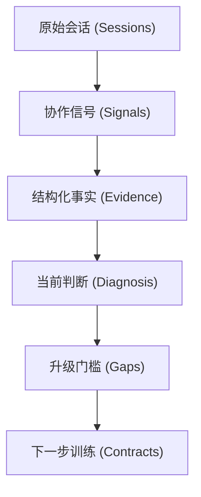

# AI Growth Mirror 输出根因分析

> **核心使命**：AI 成长镜（AI Growth Mirror）不是为了生成一张“好看的 AI 使用海报”，而是将隐性且难以察觉的 **AI 协作习惯**，转化为显性、可解释、可练习的**能力成长图谱**。

---

## 1. 核心链路定义

产品必须完整讲透并串联以下行为演进链路：

`原始会话` -> `协作信号` -> `结构化事实` -> `当前判断` -> `升级门槛` -> `下一步训练`

---

## 2. 痛点：为什么需要此类产品？

AI 编程用户每天在日常开发中会产生大量高杠杆、却不易被肉眼直观察觉的协作行为：
- **首轮框架**：是否在第一步就前置了目标、约束、上下文与验收标准？
- **流程编排**：是否能驱动 AI 进行连续的工作流推进，还是每一步都需要人工硬接管？
- **闭环验证**：是否将运行测试、错误排查、提交验证纳入了主链路？
- **资产沉淀**：是否将有效的 Prompt、规则或脚本固化成了 Skill、ADR 或 Rule 文件？

如果这些行为没有得到客观量化，用户的反馈逻辑就只能停留在模糊的感性认知：
> *“我最近感觉写代码变快了。”*  
> *“我经常用 Cursor，但有时好用，有时又老犯错，找不到症结在哪。”*  
> *“每次偏航我都要花好多精力纠正它，为什么不能一次写对？”*

AI 成长镜的价值，就是为这些感性疑惑提供基于会话的**客观事实证据 (Evidence)**。

---

## 3. 为什么拒绝简单的“数据统计”？

诸如“会话条数”、“修改文件数”、“Token 消耗总量”等单纯的数字指标，并不能有效反应与 AI 协作的深度和效率。

为了真正带来自我纠偏价值，产品必须回答用户的以下三个核心拷问：
1. **我当前处于哪个成长阶段，得出这个判断的事实依据是什么？** (通过 `growth_level` 与 `radar_axes` 回答)
2. **阻碍我迈入下一层级的核心短板是什么？** (通过 `gap_rankings` 与 `top_deficits` 回答)
3. **我下次发送 Prompt 时到底该怎么提？** (通过 `rewrite_cards` 与 `Action Contract` 回答)

---

## 4. 方法论主线：四证法

AI 成长镜统一通过 **四证法**（Context / Flow / Proof / Asset）来审视和诊断用户的 AI 协作素养：

> [!TIP]
> - **Context Frame (上下文框架)**：在协作启动与对齐阶段，对目标、约束、上下文及验收基准的确立清晰度（可通过单轮精准或多轮澄清完成）。
> - **Flow Orchestration (工作流编排)**：多步协作的连续推进能力及人机分工定位。
> - **Proof Loop (闭环验证环)**：开发后的单元测试、编译验证、错误恢复等事实校验。
> - **Method Asset (方法资产化)**：将最佳实践固化为本地 Skill 规则或工程规范并回流复用。

所有产品展示页、LLM 诊断逻辑和提示词输出都必须回锚到这四条主线证据上，拒绝无端的分数判定。

---

## 5. 产品输出约束

- **一眼可读**：用户能在 3 分钟内通读完报告，首屏直观呈现“你在哪 -> 缺什么 -> 练什么”。
- **证据一致**：报告内的协作等级、缺陷诊断、改写建议与训练任务必须环环相扣，口径一致。
- **如实披露**：明确标示数据的置信边界（包含 LLM 覆盖度与 Insufficient Input 计数），不对 heuristic 结果做智能润色。
- **正向回流**：产品旨在引导用户自我进化，绝对不包含任何用于组织考核、绩效排名的倾向性词汇（如：员工、绩效、排名、打分画像）。

---

## 修订记录

- **2026-06-06**：重构文档结构，使用 Mermaid 流程图与 GitHub 警报框提升可读性，对齐 Product v0.4.2 术语体系。
- **2026-05-27**：词汇与当前个人版主链对齐。
