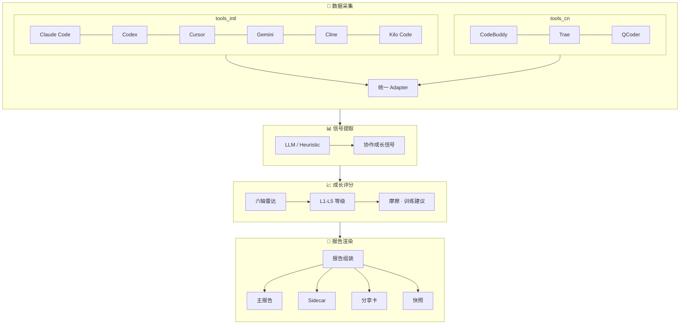

# AI Growth Mirror — 架构总纲

> **本文是代码库的唯一架构权威文档。** 任何功能开发、重构、代码审查都必须遵循本文。

AI Growth Mirror 是一款面向 AI 编程工具用户的**个人成长镜子**，也是 **Agentic 操作成熟度评估系统**。它从本机读取 AI 编码工具的历史会话（Claude Code、Codex、Cursor、Gemini、Cline、Kilo Code、CodeBuddy、Trae、QCoder 共 9 款），生成结构化的成长洞察报告，帮助用户发现协作盲点、提升 AI 工具使用效率。

**核心目标**：帮助使用 AI 工具的人提升自我，不是给单人用的报告工具，而是对所有 AI 工具用户通用的产品。

> **v0.7+ 核心定位**：AI Growth Mirror 不是 Prompt 打分器。它评价的不是"你的 Prompt 写得有多完整"，而是"你能否把 AI 变成稳定可复用的生产力系统"。评估维度从"任务表达能力"演进为"Agentic 操作成熟度"。

**基本原则**：
- 框架与评级体系写死（Growth Level L1-L5、六轴成长底盘）
- 文案、洞察、建议通过 LLM + 结构化提示词动态生成
- 本地优先，数据不出本机

### 1.1.1 当前价值保护边界

- narrative / usage / features / horizon / sidecar / CLI 的删改冻结边界见项目技能 `ai-growth-mirror-dev` → `references/value_recovery_inventory.md`
- 未经用户明确确认，不允许删除 inventory 中冻结的主链能力

### 1.1 当前评估方法论（产品真源）

AI Growth Mirror 统一使用 **四证法** 解释一个人的 AI 使用水平：

- **Context Frame**：是否在协作启动与对齐阶段建立清晰的目标、约束和验收标准（可通过单轮精准或多轮澄清完成）
- **Flow Orchestration**：是否能让 AI 连续推进，而不是每一步都靠人工接管
- **Proof Loop**：是否把验证、测试、回看放进主流程，保证事实性
- **Method Asset**：是否把有效做法沉淀成模板、规则、脚本、Skill 或流程

产品所有输出都必须能回到这四条证据链，不允许出现"分数有了，但用户看不懂为什么"的展示。

> **四证法是方法论入口，§1.2 六轴是其可度量展开**：Context Frame → `collaboration_framing`；Flow Orchestration → `execution_driving` + `implementation_depth`；Proof Loop → `delivery_closure` + `adaptive_recovery`；Method Asset → `agentic_system`。四证法用于对外解释，六轴用于评分与雷达；两者一一可追溯，不得各自独立演化。

### 1.2 当前成长评分主轴（产品真源）

个人版自 v0.7 升级、v0.8 定稿为 **六轴 Agentic 成熟度底盘**（轴名真源 `domain/growth/scorer.py`）：

| 轴 key | 中文名 | v0.8 权重 | 衡量内容 |
|--------|--------|:---------:|----------|
| `collaboration_framing` | 协作框定 | **14%** | 协作启动质量：方向清晰、上下文注入、目标锁定速度与主动澄清率（v0.7 旧名 `intent_clarity`） |
| `execution_driving` | 协作驱动 | **25%** | 自主工具链长度、子代理编排与人机协作节奏（Agentic 主战场） |
| `implementation_depth` | 实现下潜 | **20%** | 文件修改量、代码验证覆盖率与实现边界控制 |
| `delivery_closure` | 交付收口 | **20%** | 任务完成率、验证行为率与测试用例运行表现 |
| `adaptive_recovery` | 恢复推进 | **10%** | 偏航/报错/阻塞时基于新证据的纠偏质量（已剔除 environmental-recovery 误判） |
| `agentic_system` | Agentic 系统化 | **11%** | skill/workflow/MCP/subagent 等方法资产化能力（v0.7 升格为第六个正式轴） |

权重合计 100%；演进对照见 [v0.7.0-DESIGN.md](v0.7.0-DESIGN.md) 与 [v0.8.0-DESIGN.md](v0.8.0-DESIGN.md)。

`mirror_score`（协作指数）与 `growth_level`（L1–L5）由这六轴加权 + 置信修正推出，不得再回退为旧线性加权模型的换皮版本。雷达图按六边形渲染；旧五轴快照加载时 `agentic_system` 标注「暂无数据」，不报错、不强制重算。

### 1.2.1 L1–L5 等级分值分布与设计理由

**真源**：`domain/growth/scorer.py → _LEVEL_MIN_SCORE`。任何展示层（report_view、level_guide yaml、README）均以此为唯一权威，禁止另起一套区间。

#### 等级区间

| 等级 | 协作指数区间 | 跨度 | 典型用户状态 |
|------|------------|------|-------------|
| **L1** | 0–37 | 38 分 | 以问答为主，无稳定协作闭环 |
| **L2** | 38–55 | 18 分 | 已有真实任务协作，但习惯不稳定 |
| **L3** | 56–74 | 19 分 | 能持续推进多步任务，形成稳定节奏 |
| **L4** | 75–89 | 15 分 | 能编排工具链与验证链路，交付稳定 |
| **L5** | 90–100 | 11 分 | 能设计并复制高杠杆 AI 工作流 |

#### 非等宽分布的设计理由

1. **L1 宽（38 分）**：入门跨越大，鼓励用户尽快迈过"问答阶段"。真实用户在 L1 停留时间短，一旦开始用于真实任务即快速进入 L2。
2. **L2/L3 中等（各约 18–19 分）**：这是绝大多数活跃用户分布的区间，设计为线性成长区，每一分都可感知。
3. **L4 收窄（15 分）**：进入 L4 不只靠分数，还需满足 Agentic 系统保底条件（见下）；区间收窄确保 L4 代表真实能力水位。
4. **L5 最窄（11 分）**：设计为稀有等级，须同时满足高 Agentic 系统分、高执行驱动、有效交付等多轴条件，不能靠单轴拉满突破。

#### 样本置信封顶

| 有效会话数 | 协作指数上限 | 说明 |
|-----------|------------|------|
| < 8 | 69 | 封顶在 L3 内；不允许样本过少时进 L4 |
| < 15 | 82 | 封顶在 L4 内；不允许样本过少时进 L5 |
| ≥ 15 且满足 Agentic 条件 | 无限制 | 由评分公式自然决定 |

有效 session read < 5 时不输出正式等级（显示「待评估」）。

#### L4/L5 保底抬升条件

为避免 Agentic 能力强但总分因某轴拖累而被低估，设置保底抬升：

- **L4 保底**：`session_count ≥ 15` 且 `agentic_system ≥ 75` 且 `execution_driving ≥ 70` 且 `implementation_depth ≥ 65` 且 `delivery_closure ≥ 50` → 总分至少 75
- **L5 保底**：`session_count ≥ 15` 且 `agentic_system ≥ 88` 且 `execution_driving ≥ 78` 且 `implementation_depth ≥ 70` 且 `delivery_closure ≥ 65` 且 `adaptive_recovery ≥ 55` → 总分至少 90

#### 分轴达标线（阶段评估展示用，不等同于总分区间）

各等级在「阶段评估」区块显示的**下一级证据线**，用于解释"为什么还没升级"：

| 目标等级 | 任务表达 | 协作驱动 | 实现下潜 | 交付收口 | 恢复推进 | Agentic |
|---------|---------|---------|---------|---------|---------|---------|
| L2 | 42 | 45 | 40 | 40 | 38 | 35 |
| L3 | 56 | 58 | 55 | 55 | 52 | 52 |
| L4 | 72 | 74 | 70 | 70 | 68 | 75 |
| L5 | 86 | 86 | 84 | 84 | 82 | 88 |

> **注意**：分轴达标线是解释用的展示门槛，**不是**总分映射规则。总分由六轴加权 + 修正项共同决定，再映射到 `_LEVEL_MIN_SCORE` 确定等级。

### 1.3 支持的 AI 编码工具

与仓级 `README.md` 一致，当前接入 **9 款** AI 编码工具：

| 类型 | 工具 |
|------|------|
| 国际主流 | Claude Code、Codex、Cursor、Gemini、Cline、Kilo Code |
| 国产 | CodeBuddy、Trae、QCoder |

CLI `--tools all` 一次扫齐；也可按需指定单个或多个。各工具经统一 Adapter 适配层汇入同一套评分与报告链路。

### 1.4 产品主流程

对外流程图与 `README.md` §核心流程 保持一致：



---

## 2. 分层架构

### 2.1 依赖链（严格遵守，禁止反向）

```
Adapter (cli.py)  ──或──  application/orchestrator.py（程序化入口）
    ↓
Application (application/)
    ├─ 组装 personal report DTO / growth plan / summary payload
    ├─ HTML 渲染（html_render.py，纯 Jinja）
    └─ 写盘 / 快照（personal_report_service.py + infra）
    ↓ 只依赖标准库、模板与 application 提供的内存对象
Domain (domain/)
    ↑
Infrastructure (infra/)   ← 实现 readers / i18n / LLM / cache / snapshots
```

**关键约束**：
- `domain/` 绝对不 import `infra/`、`application/`（零技术依赖）
- `domain/` 可 import 标准库，不可 import 第三方框架
- `application/` 负责 personal report **全流程编排**：collect → extract → aggregate → coaching → assemble view/payload → render → write
- `application/` 负责把 **成长轨迹 + Prompt 成长教练 + 下一阶段训练冲刺** 组装成同一条闭环，不允许把这三块拆成互不引用的孤立模块
- `application/` 通过 `infra/` 完成一切 I/O、LLM、YAML 加载；通过 `application/html_render.py` 完成 HTML 字符串渲染
- `application/html_render.py` **禁止** 文件读写、网络/LLM 调用、直接加载 YAML、view 组装；只接收 application 预组装的 DTO 与 label catalog
- **无**独立 `report/` 包；HTML 渲染仅在 `application/html_render.py`
- `infra/` 实现具体技术能力（含 `infra/i18n/catalog.py`），依赖 `domain/` 模型
- `cli.py` 是 Adapter，只解析 CLI 入参并调用 `application/`
- 程序化调用直接使用 `application/orchestrator.generate_report_artifacts`（无独立 `api.py` 模块）
- `domain/` 只产出语义键、状态和数值；所有面向用户的说明文案、label、reason、gap 文本都在 `application/` 组装层 + `assets/i18n/`

### 2.2 各层职责

| 层 | 路径 | 职责 | 禁止 |
|---|---|---|---|
| Domain | `domain/` | 纯业务契约：实体、值对象、枚举、纯算法、DTO parser、评分底盘 | import infra/application; 任何 I/O；任何最终展示文案 |
| Infrastructure | `infra/` | 技术实现：readers、extractors、LLM client、cache、snapshots、**i18n YAML adapter** | 写业务规则；定义业务枚举 |
| Application | `application/` | **personal report 主编排**：`generate_report_artifacts`、collect/extract/aggregate/coaching/组装 ViewModel/summary payload/写盘/快照；**HTML 渲染**（`html_render.py`） | 在 `html_render.py` 做 view 组装或 I/O |
| Assets | `assets/` | 静态资产：LLM 提示词（`assets/prompts/`）+ UI 标签 YAML（`assets/i18n/`）+ HTML 模板（`assets/templates/`） | 不属于任何层；不含 Python 逻辑 |

### 2.2.1 Snapshot / Trajectory / Coach 闭环分工

这一条链路的职责边界固定如下：

- `domain/snapshots/model.py`
  - 只定义 `SnapshotSource`、`TrajectoryPoint`、`TrajectorySummary`、`LatestVsPreviousSummary` 等纯数据结构
- `domain/snapshots/comparison.py`
  - 只做“两期 delta / waterfall / confidence / evidence card”纯计算
- `domain/snapshots/trajectory.py`
  - 只做“30 天窗口裁剪 / 时间排序 / 同日折叠 / 趋势分类 / latest_vs_previous 纯摘要”
- `infra/snapshots.py`
  - 只负责 snapshot archive 读取、近 30 天历史加载、legacy fallback、compare 数据写盘
- `application/growth_trajectory.py`
  - 负责把 `window_points + daily_points + trend_summary + latest-vs-previous` 组装成统一 view model 与 sidecar 子结构
- `application/prompt_coach.py`
  - 负责把 PQ / finding / takeaway / prompt_style / closure_guidance / 模板 / checklist 组装成诊断视图
- `application/growth_plan.py`
  - 负责消费 `growth_trajectory + prompt_coach`，生成唯一完整训练计划展示区
- `application/summary_payload.py`
  - 负责把 `growth_trajectory / prompt_coach / growth_plan` 输出成稳定 sidecar schema
- `assets/templates/*.j2`
  - 只做展示，不允许读取文件、不允许做业务判定、不允许内联趋势计算

新增能力的红线：

- 主报告 `generate` 首次运行仍然只归档 snapshot，不展示成长轨迹区块
- 主报告第二次及以后默认展示“近 30 天趋势 + 本期 vs 上一期辅助诊断”
- `compare` 继续只处理任意两期 snapshot，不读取 30 天窗口，不干扰主报告自动对比逻辑

---

## 3. 目录结构（终版）

```
ai_growth_mirror/
│
├── domain/                        # 纯业务契约层（零技术依赖）
│   ├── session/
│   │   ├── model.py               # SessionRecord
│   │   ├── scope.py               # SessionScope + apply_session_scope()
│   │   ├── tool_registry.py       # 工具选择词汇表
│   │   └── heuristics.py          # prompt / creation·reuse / growth 规则
│   ├── ingestion/
│   │   └── model.py               # CollectionResult / ToolCollectorSpec
│   ├── common/
│   │   └── contracts.py           # PromptRenderRequest / LlmCallRequest
│   ├── signals/
│   │   ├── taxonomy.py            # ResistanceKind, MomentumKind, WorkStyle, …
│   │   ├── model.py               # SessionRead / PromptLensScores / ResistanceSignal
│   │   ├── payloads.py            # LLM JSON → SessionRead parser
│   │   ├── collab.py              # CollaborationStyleResult
│   │   ├── framework.py           # 信号框架常量
│   │   └── tooling.py             # tool normalization / capability tier 规则
│   └── growth/
│       ├── model.py               # GrowthProfile, GrowthScore, AgentAssetStats
│       ├── scorer.py              # aggregate()（纯计算，无 I/O）
│       ├── highlights.py          # surface_highlights()
│       ├── evidence.py            # build_core_evidence()（schema-versioned 事实包）
│       ├── costs.py               # token 费用策略与估算
│       ├── coaching.py            # CoachingContent DTO / parser
│       ├── planning.py            # GrowthPlan DTO / 纯规划逻辑
│       ├── capability.py          # compute_capability_scores()（六轴展示分）
│   └── signals/collab.py          # 协作风格（报告展示真源）
│
├── infra/                         # 基础设施层（一切有 I/O 或技术依赖）
│   ├── readers/                   # 各 AI 工具 session 读取器
│   │   ├── base.py                # BaseSessionAdapter + 工具函数
│   │   ├── claude_code.py         # ClaudeCodeSessionAdapter
│   │   ├── cursor.py
│   │   ├── codex.py
│   │   ├── json_reader.py
│   │   ├── workspace_storage.py
│   │   ├── qoder.py
│   │   └── trae.py
│   ├── extractors/                # Signal 提取器（LLM + 规则）
│   │   ├── llm.py                 # LLM session read 提取（批量+缓存）
│   │   ├── heuristic.py           # 规则 session read 提取
│   │   └── prompt_quality.py      # LLM prompt lens 评估
│   ├── llm/
│   │   ├── client.py              # provider adapter + gateway
│   │   ├── limiter.py             # provider-aware execution policy
│   │   └── coach.py               # Coaching 内容 LLM 生成
│   ├── snapshots.py               # 快照归档与 compare
│   ├── i18n/
│   │   └── catalog.py             # YAML catalog adapter（唯一 i18n 加载入口）
│   ├── enrichers/
│   │   └── asset.py               # Agent asset 目录扫描
│   ├── cache/
│   │   └── store.py               # CacheStore（磁盘缓存）
│
├── application/
│   ├── orchestrator.py            # generate_report_artifacts：collect→extract→score→report
│   ├── personal_report_service.py # coaching + 渲染编排 + 写盘 + 快照归档
│   ├── report_view.py             # PersonalReportView + build_personal_report_view 真源
│   ├── html_render.py             # render_personal_report_html / render_share_card_html（纯 Jinja）
│   ├── growth_trajectory.py       # 30 天趋势 + latest-vs-previous 视图组装
│   ├── prompt_coach.py            # Prompt 成长教练诊断器组装
│   ├── growth_plan.py             # GrowthPlanView + build_growth_plan 真源
│   ├── summary_payload.py         # build_personal_summary_payload 真源
│   └── label_catalogs.py          # ReportLabelCatalogs + load_report_label_catalogs
│
├── assets/                        # 所有静态资产
│   ├── __init__.py                # ASSETS_DIR / I18N_DIR / PROMPTS_DIR / TEMPLATES_DIR
│   ├── prompts/                   # LLM 提示词 Jinja2 模板
│   │   ├── session_read/
│   │   ├── prompt_lens/
│   │   └── growth_coach/
│   ├── i18n/                      # UI 标签 YAML（非业务逻辑）
│   └── templates/                 # HTML 渲染模板（Jinja2）
│       ├── report.html.j2
│       ├── share_card.html.j2
│       └── snapshot_compare.html.j2
│
├── cli.py                         # CLI 入口（Adapter）
├── product.py                     # 产品常量（名称、路径、版本）
└── config.py                      # 配置加载
```

---

## 4. 数据流

```
用户配置 config.yaml
    ↓
cli.py（Adapter）或 orchestrator.generate_report_artifacts（程序化）
    ↓
application/orchestrator.generate_report_artifacts()
    ├── infra/readers/           读取 session 原始日志
    │       ↓ SessionRecord (domain/session/model.py)
    ├── infra/extractors/        提取 signal（LLM 或规则）
    │       ↓ SessionRead (domain/signals/model.py)
    ├── infra/cache/             缓存 SessionRead
    ├── domain/growth/scorer.py  汇总 GrowthProfile（纯计算）
    │       ↓ GrowthProfile (domain/growth/model.py)
    ├── application/personal_report_service.py
    │       ├── infra/llm/coach.py            CoachingContent（LLM，可选）
    │       ├── application/report_view.py    PersonalReportView
    │       ├── application/summary_payload.py  summary payload
    │       ├── application/html_render.py    HTML 字符串（纯内存）
    │       └── infra/snapshots.py + 文件写盘    HTML / JSON sidecar / share / 快照
            ↑ assets/prompts/     动态内容由 infra LLM + 提示词模板生成
            ↑ assets/i18n/        标签 YAML 真源；经 application/label_catalogs + infra/i18n/catalog 加载
            ↑ assets/templates/   html_render Jinja 渲染
```

### 4.1 成长轨迹对齐规则

- `application/personal_report_service.py` 在写入本期 snapshot 之前，先读取 `ai-growth-mirror-archive/index.json`
- 若 archive 中没有历史条目：`growth_trajectory.available = false`，本期报告不显示该区块
- 若 archive 中已有历史条目：本期报告默认展示近 30 天窗口趋势，并在同区块底部补“本期 vs 上期”辅助诊断
- 任意两期的手工对比不走主报告自动区块，而走 `cli.py compare` → `infra/snapshots.py::compare_snapshots`
- **纯逻辑边界**：`domain/snapshots/*` 只定义 snapshot source / comparison DTO 与 delta 计算；`infra/snapshots.py` 只负责 archive 读写与 compare 装载；`application/growth_trajectory.py` 负责把 `window_points / daily_points / trend_summary / latest_vs_previous` 组装成 view model；`application/html_render.py` 只做模板渲染，不读文件、不做业务计算
- **快照输入真源**：compare 组装优先读取 snapshot 下的 `summary.json`、`report.json`、`normalized-summary.json`，只在字段缺失时回退 `profile.json`
- **sidecar 对齐**：主报告 `.json` sidecar、`*.summary.json`、archive `report.json` 和 compare 产物 `comparisons/*.json` 都必须包含结构化 `growth_trajectory`；主报告使用 `window_points / daily_points / trend_summary / latest_vs_previous`

### 4.2 Prompt Quality 主链约束

- `infra/extractors/llm.py` 负责优先接入 LLM 语义 PQ；当会话过短或 LLM 不可用时，必须降级到 `infra/extractors/heuristic.py` 的代理回填，而不是直接断档
- `domain/signals/model.py::PromptLensScores` 携带 `evaluation_status`（`llm_evaluated | insufficient_input | llm_failed | llm_unavailable | not_applicable`）区分评估来源状态；`source_engine`（`llm | heuristic`）仅作内部引擎标记，不上主报告；`coverage`（`full | light | none`）仅表示完整度
- `domain/cache_schema.py::SESSION_READ_SCHEMA_VERSION` 当前为 `"1.1"`；升版时旧 reads 缓存自动失效并重跑
- `domain/growth/scorer.py` 聚合时输出：`pq_llm_session_count / pq_heuristic_session_count / pq_light_session_count`（向后兼容），以及新增 `pq_llm_evaluated_count / pq_insufficient_count / pq_llm_failed_count / pq_llm_unavailable_count`（按 evaluation_status 统计）
- `application/report_view.py` / `prompt_coach.py` 展示层按非零子句拼装人话来源说明，严禁把 heuristic 直接说成 LLM Prompt 质量评估，禁止展示 `LLM n / heuristic n / light n` 并列数字
- `domain/growth/prompting.py` 提供 `closure_guidance.mode`（`open_ended | engineered` 派生，不升 schema）与 `friction_synthesis` 规则意图层；`assets/prompts/growth_coach/system.md.j2` 加性扩展 LLM 输出 `friction_synthesis`，应用层护栏：evidence_refs 为空则丢弃降级规则

### 4.3 Usage / Asset 边界

- usage 区块只展示真实已采数据：`token / cost / cache / subagent / MCP / collaboration intensity`
- **Token / 成本 / 缓存只统计有 usage 明细的数据源**：`domain/growth/scorer.py` 仅累加 reader 写入非 `None` 的 `input_tokens` / `output_tokens` / cache 字段；当前以 Codex、Claude Code 为主；Cursor / Trae / QCoder 等无 usage 日志的会话仍参与成长评分，但不进入 Token / 成本 / 缓存汇总
- 无可用 usage 时 UI 显示 `--`，禁止用 0 伪装“已统计”
- `memory` 当前未采集，必须显式标注，而不是靠缺字段隐式表示
- `infra/enrichers/asset.py` 必须按**已解析文件路径**去重，避免 overlapping roots 同一路径重复计数或重复暴露到 UI

---

## 5. 核心模型（当前真源）

| 模型 | 路径 | 职责 |
|---|---|---|
| `SessionRecord` | `domain/session/model.py` | 单会话元数据、usage、项目路径 |
| `SessionRead` | `domain/signals/model.py` | 单会话 session read、Prompt Lens、阻力/动量信号 |
| `GrowthProfile` | `domain/growth/model.py` | 聚合后的成长画像与 scorecard |
| `Blocker` / `Accelerator` | `domain/signals/model.py` | 摩擦点 / 有效模式 |
| `InteractionKind` | `domain/signals/taxonomy.py` | 工具交互类型 |
| `CoachingContent` | `domain/growth/coaching.py` | LLM coaching DTO |
| `PersonalReportView` | `application/report_view.py` | 报告展示 DTO（非 domain） |

---

## 6. 枚举归 domain 原则

**所有业务枚举必须在 `domain/` 层定义**，不得在 `infra/` 或 `application/html_render.py` 中定义业务枚举。

当前 `domain/signals/taxonomy.py` 包含：
- `ResistanceKind`、`MomentumKind` — 摩擦/加速器分类
- `PQDeficitKind`、`PQStrengthKind` — 提示词质量分类
- `WorkStyle`、`CapabilityFocus`、`CapabilityDepth` — 协作/创作风格（StrEnum）
- `InteractionKind` — 工具交互类型（IntEnum）
- `ModelCapabilityTier` — 模型能力等级（IntEnum）

`domain/signals/tooling.py` 定义 `normalize_tool_name()` 等工具名→`InteractionKind` 映射；`InteractionKind` 枚举在 `domain/signals/taxonomy.py`。

---

## 7. LLM 内容生成策略

**写死的内容**（代码 / YAML 常量）：
- Growth Level 等级体系（L1-L5 定义、升级门槛）
- 六轴成长底盘（轴名、状态边界、图表字段）
- UI 标签、报告框架结构

**LLM 动态生成的内容**（`assets/prompts/*.md.j2`，当前主链仅三目录）：
- 每会话 Session Read 提取（`session_read/`）
- Prompt Lens 点评（`prompt_lens/`）
- Coaching 建议（`growth_coach/`）

**Prompt 文案口径约束**：
- 面向公开仓库的 system/user prompt 必须使用中性产品口径，如 `evidence packet`、`reflection report`、`prompt lens`
- 禁止回流旧品牌、组织绩效、私域交付或 review 工具链暗示性文案
- Prompt 的 schema / taxonomy 兼容性优先由 `domain/**` parser 保证；文案重写不得破坏解析契约

**Fallback**：`session_read_mode=heuristic` 时用 `infra/extractors/heuristic.py` 规则提取；Coaching 在无 LLM 时降级为通用建议框架。

---

## 8. 静态资产治理（assets/）

`assets/` 是唯一的静态资产目录，包含两类文件：

**`assets/prompts/`** — LLM 提示词 Jinja2 模板：
- 修改提示词只改此目录，不改 Python 代码
- 决策树 / 分类指令在 `assets/prompts/session_read/guidelines.md.j2`，由 `system.md.j2` include
- 当前子目录：`session_read`、`prompt_lens`、`growth_coach`
- 共享输出语言约束放在 `assets/prompts/_partials/output_language.md.j2`
- `assets/prompts/**/bak/` 只是本地备份区，不是提示词真源，也不参与发布

**`assets/i18n/`** — UI 标签 YAML（非业务逻辑）：
- Guidance Lens 分类标签：`guidance_labels_zh/en.yaml`
- fallback 规则文案：`fallback_signals_zh/en.yaml`
- ViewModel / 模板 / 成长计划标签：`view_model_*`、`template_labels_*`、`growth_plan_*`、`level_guide_*`
- 各语言 UI label 文件真源在 `assets/i18n/`；加载经 `application/label_catalogs.py` 与 `infra/i18n/catalog.py`
- `html_render.py` 接收 application 预加载的 catalog dict，**不直接**读取 YAML

---

## 9. 缓存与配置路径

**配置加载**（`config.resolve_config_path`）：

- 显式 `-c` / API 入参优先
- 否则当前工作目录 `./config.yaml`（若存在）
- 否则回退 `~/.ai-growth-mirror/config.yaml`

**缓存**：

- 每会话 Session Read（`SessionRead`）按 `session_id + schema_version` 缓存到磁盘
- **默认**缓存根目录：`<cwd>/.ai-growth-mirror-runtime/cache/`（与报告输出、run manifest 同工作区；已 `.gitignore`）
- 会话元数据（`SessionRecord`）：`.../records/{tool_name}/{session_id}.json`
- Session Read 分析结果：`.../reads/{tool_name}/{session_id}.json`
- 可通过 `config.yaml` 的 `cache.dir` 覆盖；**不**再默认把缓存放 home
- LLM Coaching 内容：按 `GrowthProfile.hash()` 缓存，避免重复调用
- 首次运行冷启动耗时取决于会话数量；后续增量更新

---

## 10. 当前产品输出骨架

个人版当前输出层必须同时支持：

- `scorecard.radar_axes`：六轴主图数据
- `growth_signals.gap_rankings`：当前短板排序
- `summary.growth_stage`：阶段解释层
- `trend_signals`：多期变化与留存抓手
- `next_actions`：可执行动作建议

这些字段允许逐步丰富，但不得再把 domain 里的硬编码解释文案塞回评分函数。

## 11. 运行环境

- Python **3.12+**（见 `pyproject.toml`、`README.md`、CI）
- 安装：`pip install -e .`；Anthropic / Gemini provider 需 `pip install -e ".[llm]"`

## 12. 扩展点

| 扩展场景 | 扩展位置 |
|---|---|
| 新增 AI 工具 | `infra/readers/` 新增 adapter，实现 `BaseSessionAdapter` |
| 新增 Session Read 提取维度 | `domain/signals/model.py` 加字段 + `prompts/session_read/system.md.j2` 更新 schema |
| 新增报告板块 | `application/report_view.py` + `assets/templates/report.html.j2` |
| 新增 LLM 生成内容 | `assets/prompts/` 新建模板 + `infra/llm/` 对应调用点 |
| 修改 Growth Level 门槛 | `domain/growth/scorer.py`（唯一入口） |
| 修改六轴权重与状态边界 | `domain/growth/scorer.py` 中的底盘规则 |

---

## 13. 反模式（禁止）

- `domain/` 中出现任何 `import infra`、`import requests`、`import sqlite3`
- `infra/` 中定义业务枚举（应上收到 `domain/signals/taxonomy.py`）
- 在 Python 代码中硬编码 LLM 生成的文案（应在 `assets/prompts/` 或通过 LLM 生成）
- 在 `domain/growth/scorer.py`、`domain/signals/*` 中硬编码面向用户的中英文解释文案
- `application/html_render.py` 中直接 `open()` / `Path.write_*` / 调用 LLM / `load_catalog` / 组装 view（I/O 与 LLM 归 application service + infra）
- 在 `application/report_view.py` 或 `html_render.py` 中用 `if language == 'zh'` 硬编码展示文案（应在 `assets/i18n/`，由 application 注入 catalog）
- 新建独立 `report/` 包或在 `html_render.py` 复制 view 组装逻辑
- 在 `cli.py` 内复制 collect → extract → aggregate 主编排

---

## 14. 研发架构与逻辑硬规范

> [!NOTE]
> **[v0.4.2 架构增量]**：以下四类硬规范于产品版本 **v0.4.2** 中引入，配合缓存 Schema **1.2** 正式生效，旨在打通多端数据同步、缓存防颠簸以及大规模会话日志场景下的吞吐与评分准确性底座。

为确保 AI Growth Mirror 在大规模日志、多机器同步、无 Token 数据源等现实场景下的鲁棒性，特设立以下四类研发硬规范及配套计算逻辑：

### 14.1 缺失型指标动态归一化规范
- **原则**：若数据源不支持或缺失了某类指标（如 Cursor/Trae/QCoder 等不提供 LLM Token 数量和计费明细），在计算评分时**不得**将其计为 `0` 予以惩罚。
- **计算逻辑**：
  - 在 [scorer.py](../../ai_growth_mirror/domain/growth/scorer.py) 汇总前，首先通过 `any(s.input_tokens is not None for s in sessions)` 校验是否有可用的 Token 数据。
  - 若无 Token 数据，计算 `implementation_depth` 时动态将 `total_token_volume` 权重元组（18%）从 `_bounded_average` 的参数列表中剔除。
  - `_bounded_average` 内部根据剩余参数的总权重（`0.32 + 0.20 + 0.15 + 0.15 = 0.82`）动态求加权平均，自动完成权重归一化。

### 14.2 共享数据库 Per-Session Revision 机制
- **原则**：对于多会话共享单一数据库（如 Trae 或 QCoder 的 `state.vscdb`）的数据源，禁止直接使用整个数据库文件的 `stat().st_mtime` 作为缓存版本戳，防止无关的 IDE UI 状态写入导致缓存过度失效（颠簸）。
- **计算逻辑**：
  - 在 [base.py](../../ai_growth_mirror/infra/readers/base.py) 引入 `get_vscdb_mtime(state_db)` 时间感知器。
  - 读取并拼接 `state.vscdb` 中与 AI 对话和代理状态直接相关的行（包含 `%input-history%`、`%ai-agent-storage%`、`%modelMap%`）生成内容哈希。
  - 当且仅当内容哈希发生改变时，才允许 `st_mtime` 推进并更新内存缓存；否则返回上一次稳定的 `mtime`，保证缓存稳定命中。

### 14.3 跨端标识与缓存路径隔离规范
- **原则**：在多机器或多数据根场景下，session 的唯一标识和去重不得只依赖 `session_id`，且不同机器的缓存必须物理隔离，防止跨端覆盖。
- **计算逻辑**：
  - 去重键：由原本的 `session_id` 升级为 `(source_machine, session_id)` 双重键。
  - 缓存路径：在 [store.py](../../ai_growth_mirror/infra/cache/store.py) 中，当 `source_machine != "local"` 时，缓存路径由默认的 `records/{tool_name}/{session_id}.json` 隔离为 `records/{tool_name}/{source_machine}/{session_id}.json`，实现完全的物理隔离。

### 14.4 惰性解析与按需加载采样规范
- **原则**：在大规模日志（数万/多年历史）场景下，为避免扫描阶段因全量载入深度解析造成 CPU 和内存过载，必须采用 Placeholder 惰性解析机制。
- **计算逻辑**：
  - 在 [base.py](../../ai_growth_mirror/infra/readers/base.py) 的 `_iter_sessions_from_root` 中，若 cache 启用且未命中缓存，先快速构建一个带有 `_is_placeholder = True` 的轻量级 `SessionRecord`，其仅通过子类实现的 `_quick_extract_project_path`（如极速加载 `workspace.json`）带上项目路径。
  - 直到 [orchestrator.py](../../ai_growth_mirror/application/orchestrator.py) 对会话执行完 Scope 过滤和采样限额后，才对最终确定的 sessions 列表调用 `session.ensure_parsed(cache)`，就地完成深度解析并写盘。未选中样本不发生任何深度解析开销。

