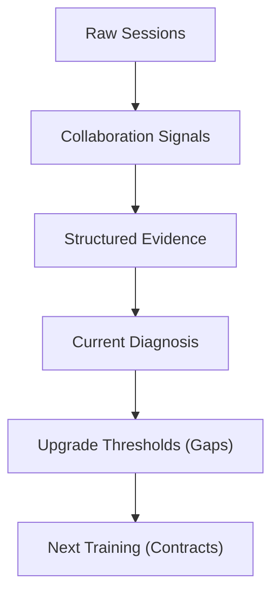

Chinese version: [AI_GROWTH_MIRROR_OUTPUT_ROOT_CAUSE_ANALYSIS.md](../../design/AI_GROWTH_MIRROR_OUTPUT_ROOT_CAUSE_ANALYSIS.md)

# AI Growth Mirror Output Root Cause Analysis

> **Core mission**: AI Growth Mirror is not about generating a "pretty AI usage poster." It turns implicit, hard-to-notice **AI collaboration habits** into an explicit, explainable, practicable **capability growth map**.

---

## 1. Core Chain Definition

The product must fully explain and connect this behavior evolution chain:

`Raw Sessions` -> `Collaboration Signals` -> `Structured Evidence` -> `Current Diagnosis` -> `Upgrade Thresholds` -> `Next Training`

---

## 2. Pain Points: Why This Product?

AI coding users produce high-leverage collaboration behaviors daily that are hard to see with the naked eye:
- **First-turn framing**: Did you front-load goals, constraints, context, and acceptance criteria in step one?
- **Flow orchestration**: Can you drive AI through continuous workflow, or does every step need manual takeover?
- **Proof Loop**: Are tests, error triage, and commit verification in the main path?
- **Method Asset**: Are effective prompts, rules, or scripts solidified into Skill, ADR, or Rule files?

Without objective quantification, feedback stays vague:
> *"I feel like I'm coding faster lately."*
> *"I use Cursor a lot, but sometimes it works and sometimes it keeps failing - I can't find the root cause."*
> *"Every time it goes off-track I spend a lot of effort correcting it - why can't it get it right once?"*

AI Growth Mirror provides session-based **objective evidence** for these questions.

---

## 3. Why Not Simple "Data Statistics"?

Metrics like "session count," "files modified," or "total Token consumption" do not reflect collaboration depth and efficiency.

To deliver real self-correction value, the product must answer three core questions:
1. **What growth stage am I in, and what evidence supports that?** (via `growth_level` and `radar_axes`)
2. **What is the core gap blocking the next level?** (via `gap_rankings` and `top_deficits`)
3. **How should I phrase my next Prompt?** (via `rewrite_cards` and Action Contract)

---

## 4. Methodology Main Line: Four-Evidence Method

AI Growth Mirror uses the **Four-Evidence Method** (Context / Flow / Proof / Asset) to assess AI collaboration literacy:

> [!TIP]
> - **Context Frame**: Clarity of goals, constraints, context, and acceptance benchmarks during collaboration startup and alignment (single precise turn or multi-turn clarification).
> - **Flow Orchestration**: Continuous multi-step collaboration and human-AI role division.
> - **Proof Loop**: Unit tests, compile verification, error recovery, and other factual checks after development.
> - **Method Asset**: Best practices solidified as local Skill rules or engineering norms and reused downstream.

All product pages, LLM diagnosis logic, and prompt outputs must anchor to these four evidence lines; arbitrary score judgments are rejected.

---

## 5. Product Output Constraints

- **Readable at a glance**: Users can finish the report in about 3 minutes; hero shows "where you are -> what's missing -> what to practice."
- **Evidence consistency**: Collaboration level, deficit diagnosis, rewrite suggestions, and training tasks must align in tone and logic.
- **Honest disclosure**: Clearly mark confidence boundaries (LLM coverage and Insufficient Input counts); do not polish heuristic results as deep intelligence.
- **Positive feedback loop**: The product guides self-evolution; it must not include org performance, ranking, or appraisal vocabulary (e.g., employee, performance, ranking, scoring portrait).

---

## Revision History

- **2026-06-06**: Restructure document; add Mermaid flow and GitHub alert boxes; align Product v0.4.2 terminology.
- **2026-05-27**: Align vocabulary with current personal main chain.
