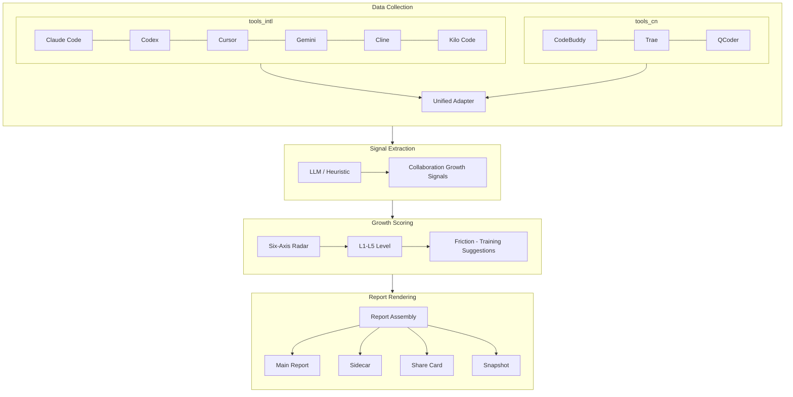

Chinese canonical version: [ARCHITECTURE_PRINCIPLES.md](../../design/ARCHITECTURE_PRINCIPLES.md)

# AI Growth Mirror - Architecture Principles

> **This document is the sole architecture authority for the codebase.** All feature development, refactoring, and code review must follow it.

AI Growth Mirror is a **personal growth mirror** for AI coding tool users and an **Agentic operating maturity assessment system**. It reads local history sessions from 9 AI coding tools (Claude Code, Codex, Cursor, Gemini, Cline, Kilo Code, CodeBuddy, Trae, QCoder), generates structured growth insight reports, and helps users find collaboration blind spots and improve AI tool efficiency.

**Core goal**: Help people who use AI tools improve themselves - not a single-user report utility but a product for all AI tool users.

> **v0.7+ core positioning**: AI Growth Mirror is not a Prompt scorer. It does not score "how complete your Prompt is" but "whether you can turn AI into a stable, reusable productivity system." Assessment evolved from "task expression ability" to "Agentic operating maturity."

**Basic principles**:
- Framework and rating system fixed (Growth Level L1-L5, six-axis growth base)
- Copy, insights, suggestions generated dynamically via LLM + structured prompts
- Local-first; data never leaves the machine

### 1.1.1 Current Value Protection Boundary

- Freeze boundaries for narrative / usage / features / horizon / sidecar / CLI changes: project skill `ai-growth-mirror-dev` -> `references/value_recovery_inventory.md`
- Without explicit user confirmation, frozen main-chain capabilities in inventory must not be removed

### 1.1 Current Assessment Methodology (Product Authority)

AI Growth Mirror uses the **Four-Evidence Method** to explain a person's AI usage level:

- **Context Frame**: Clear goals, constraints, and acceptance during collaboration startup and alignment (single precise turn or multi-turn clarification)
- **Flow Orchestration**: AI advances continuously rather than manual takeover every step
- **Proof Loop**: Verification, testing, and lookback in the main path for factual grounding
- **Method Asset**: Effective practices solidified as templates, rules, scripts, Skill, or workflows

All product output must trace to these four evidence chains; displays where "score exists but user cannot see why" are forbidden.

> **Four-Evidence Method is methodology entry; Section 1.2 six axes are measurable expansion**: Context Frame -> `collaboration_framing`; Flow Orchestration -> `execution_driving` + `implementation_depth`; Proof Loop -> `delivery_closure` + `adaptive_recovery`; Method Asset -> `agentic_system`. Four-Evidence for external explanation, six axes for scoring and radar; one-to-one traceable; must not evolve independently.

### 1.2 Current Growth Scoring Axes (Product Authority)

The personal edition uses a **six-axis Agentic maturity base**. Policy semantics are owned by `domain/growth/assessment_policy.py`, pure calculation by `domain/growth/assessment.py`; `scorer.py` only maps aggregate facts into domain inputs:

| Axis key | Label (zh) | Weight | Measures |
|--------|--------|:---:|----------|
| `collaboration_framing` | Collaboration Framing | **14%** | Collaboration startup quality: goal lock speed, active clarification rate, Effective Task Contract (v1.0.0 upgrade) |
| `execution_driving` | Execution Driving | **25%** | Continuous autonomous progress, structured workflow, and delegation with verified outcomes |
| `implementation_depth` | Implementation Depth | **19%** | Implementation sessions, code verification, achievement, and bounded file coverage |
| `delivery_closure` | Delivery Closure | **19%** | Task completion rate, verification behavior, test/build/script verification, contract fulfillment |
| `adaptive_recovery` | Adaptive Recovery | **10%** | Recovery success, correction quality, and verification after real friction opportunities |
| `agentic_system` | Agentic Systemization | **13%** | Skill/workflow/MCP/subagent methods bound to verified outcomes |

Weights total 100%; current policy is `2.0`, governed by [v1.0.2-DESIGN.md](v1.0.2-DESIGN.md).

Each component carries value, availability, confidence, evidence count, and reason code. Missing evidence is unavailable; available components and axes are dynamically renormalized with visible coverage. Raw token, file, commit, tool, model, and subagent counts do not directly score. `mirror_score` is only policy-weighted available axes plus sample caps—no bonus, floor, or second formula. Cross-policy snapshots do not emit a delta.

### 1.2.1 L1-L5 Level Score Distribution and Design Rationale

**Authority**: `domain/growth/assessment_policy.py -> LEVEL_MIN_SCORES`. Calculation and presentation consume this owner; no parallel ranges.

#### Level Ranges

| Level | Collaboration Index | Span | Typical User State |
|------|------------|------|-------------|
| **L1** | 0-37 | 38 pts | Q&A mainly; no stable collaboration loop |
| **L2** | 38-55 | 18 pts | Real task collaboration but unstable habits |
| **L3** | 56-74 | 19 pts | Multi-step tasks with stable rhythm |
| **L4** | 75-89 | 15 pts | Tool chain and verification chain orchestration; stable delivery |
| **L5** | 90-100 | 11 pts | Design and replicate high-leverage AI workflows |

#### Non-Uniform Distribution Rationale

1. **L1 wide (38 pts)**: Large entry span encourages leaving "Q&A phase." Users stay briefly in L1; real tasks quickly reach L2.
2. **L2/L3 medium (~18-19 pts)**: Where most active users sit; linear growth zone; every point perceptible.
3. **L4 narrower (15 pts)**: Coverage and sample caps require stable multi-axis evidence.
4. **L5 narrowest (11 pts)**: Raw activity volume or a single-axis modifier cannot reach it.

#### Sample Confidence Cap

| Effective Sessions | Collaboration Index Cap | Notes |
|-----------|------------|------|
| < 8 | 69 | Cap within L3; insufficient sample cannot reach L4 |
| < 15 | 82 | Cap within L4; insufficient sample cannot reach L5 |
| >= 15 | No cap | Score from available policy 2.0 evidence |

Effective session read < 5: no formal level ("pending assessment").

#### Per-Axis Threshold Lines (stage assessment display; not total score mapping)

Next-level evidence lines in "stage assessment" block explain "why not upgraded yet":

| Target Level | Task Expression | Execution Driving | Implementation Depth | Delivery Closure | Adaptive Recovery | Agentic |
|---------|---------|---------|---------|---------|---------|---------|
| L2 | 42 | 45 | 40 | 40 | 38 | 35 |
| L3 | 56 | 58 | 55 | 55 | 52 | 52 |
| L4 | 72 | 74 | 70 | 70 | 68 | 75 |
| L5 | 86 | 86 | 84 | 84 | 82 | 88 |

> **Note**: Per-axis thresholds are explanatory display gates, **not** total score mapping. Total is policy 2.0 available-axis weighting, then `LEVEL_MIN_SCORES` maps the level.

### 1.3 Supported AI Coding Tools

Aligned with repo `README.md`; **12 tools** are integrated. Tool names and CLI aliases are derived only from `infra/readers/catalog.py`:

| Type | Tools |
|------|------|
| International | Claude Code, Codex, Cursor, Gemini, OpenCode, Cline, Kilo Code, DeepSeek Harness |
| China ecosystem | CodeBuddy, Trae, QCoder, ZCode |

CLI `--tools all` scans all; or specify one or more. Unified Adapter layer into same scoring and report chain.

### 1.4 Product Main Flow

Flow diagram aligned with `README.md` core flow:



---

## 2. Layered Architecture

### 2.1 Dependency Chain (strict; no reverse)

```
Adapter (cli.py)  --or--  application/orchestrator.py (programmatic entry)
    |
Application (application/)
    |- assemble personal report DTO / growth plan / summary payload
    |- HTML render (html_render.py, pure Jinja)
    |- write disk / snapshot (personal_report_service.py + infra)
    |  depends only on stdlib, templates, in-memory objects from application
Domain (domain/)
    ^
Infrastructure (infra/)   <- readers / i18n / LLM / cache / snapshots
```

**Key constraints**:
- `domain/` must never import `infra/` or `application/` (zero technical deps)
- `domain/` may import stdlib only; no third-party frameworks
- `application/` owns personal report **full orchestration**: collect -> extract -> aggregate -> coaching -> assemble view/payload -> render -> write
- `application/` assembles **growth trajectory + Prompt growth coach + next-phase training sprint** in one closed loop; these three must not be isolated modules
- `application/` does all I/O, LLM, YAML via `infra/`; HTML strings via `application/html_render.py`
- `application/html_render.py` **forbidden**: file I/O, network/LLM, direct YAML load, view assembly; only pre-assembled DTO and label catalog
- **No** standalone `report/` package; HTML render only in `application/html_render.py`
- `infra/` implements technical capabilities (incl. `infra/i18n/catalog.py`); depends on `domain/` models
- `cli.py` is Adapter; parses CLI and calls `application/`
- Programmatic: `application/orchestrator.generate_report_artifacts` (no standalone `api.py`)
- `domain/` outputs semantic keys, states, numbers only; user-facing copy, labels, reasons, gaps in `application/` + `assets/i18n/`

### 2.2 Layer Responsibilities

| Layer | Path | Responsibility | Forbidden |
|---|---|---|---|
| Domain | `domain/` | Pure business contracts: entities, value objects, enums, pure algorithms, DTO parsers, scoring base | import infra/application; any I/O; final display copy |
| Infrastructure | `infra/` | Technical: readers, extractors, LLM client, cache, snapshots, **i18n YAML adapter** | business rules; business enums |
| Application | `application/` | **personal report orchestration**: `generate_report_artifacts`, collect/extract/aggregate/coaching/ViewModel/summary/write; **HTML render** (`html_render.py`) | view assembly or I/O in `html_render.py` |
| Assets | `assets/` | Static: LLM prompts (`assets/prompts/`) + UI label YAML (`assets/i18n/`) + HTML templates (`assets/templates/`) | not a layer; no Python logic |

### 2.2.1 Snapshot / Trajectory / Coach Closed-Loop Division

Fixed responsibility boundaries:

- `domain/snapshots/model.py`: `SnapshotSource`, `TrajectoryPoint`, `TrajectorySummary`, `LatestVsPreviousSummary` pure structures only
- `domain/snapshots/comparison.py`: two-period delta / waterfall / confidence / evidence card pure compute
- `domain/snapshots/trajectory.py`: 30-day window trim / time sort / same-day fold / trend class / latest_vs_previous pure summary
- `infra/snapshots.py`: snapshot archive read, 30-day history load, legacy fallback, compare write
- `application/growth_trajectory.py`: assemble `window_points + daily_points + trend_summary + latest-vs-previous` view model and sidecar sub-structure
- `application/prompt_coach.py`: assemble PQ / finding / takeaway / prompt_style / closure_guidance / templates / checklist diagnosis view
- `application/growth_plan.py`: consume `growth_trajectory + prompt_coach`; sole full training plan display
- `application/summary_payload.py`: stable sidecar schema for `growth_trajectory / prompt_coach / growth_plan`
- `assets/templates/*.j2`: presentation only; no file read, business judgment, or inline trend compute

Red lines for new capabilities:

- Main report `generate` first run archives snapshot only; no growth trajectory block
- Second and later runs default "last 30 days trend + current vs previous auxiliary diagnosis"
- `compare` handles any two snapshots only; no 30-day window; does not interfere with main report auto-compare

---

## 3. Directory Structure (Final)

```
ai_growth_mirror/
|
+-- domain/                        # Pure business contract (zero technical deps)
|   +-- session/
|   |   +-- model.py               # SessionRecord
|   |   +-- scope.py               # SessionScope + apply_session_scope()
|   |   +-- heuristics.py          # prompt / creation-reuse / growth rules
|   +-- ingestion/
|   |   +-- model.py               # CollectionResult / ToolCollectorSpec
|   +-- common/
|   |   +-- contracts.py           # PromptRenderRequest / LlmCallRequest
|   +-- signals/
|   |   +-- taxonomy.py            # ResistanceKind, MomentumKind, WorkStyle, ...
|   |   +-- model.py               # SessionRead / PromptLensScores / ResistanceSignal
|   |   +-- payloads.py            # LLM JSON -> SessionRead parser
|   |   +-- collab.py              # CollaborationStyleResult
|   |   +-- framework.py           # Signal framework constants
|   |   +-- tooling.py             # tool normalization / capability tier rules
|   +-- growth/
|       +-- model.py               # GrowthProfile, GrowthScore, AgentAssetStats
|       +-- assessment_policy.py   # policy, weights, and level authority
|       +-- assessment.py          # availability, coverage, axes, total pure logic
|       +-- scorer.py              # aggregate() (pure compute, no I/O)
|       +-- highlights.py          # surface_highlights()
|       +-- evidence.py            # build_core_evidence() (schema-versioned facts)
|       +-- costs.py               # token cost policy and estimates
|       +-- coaching.py            # CoachingContent DTO / parser
|       +-- planning.py            # GrowthPlan DTO / pure planning logic
|       +-- capability.py          # compute_capability_scores() (six-axis display)
|   +-- signals/collab.py          # collaboration style (report display authority)
|
+-- infra/                         # Infrastructure (all I/O or technical deps)
|   +-- readers/                   # per-tool readers; catalog.py is identity/alias owner
|   +-- extractors/                # Signal extractors (LLM + rules)
|   +-- llm/
|   +-- snapshots.py
|   +-- i18n/catalog.py
|   +-- enrichers/asset.py
|   +-- cache/store.py
|
+-- application/
|   +-- orchestrator.py            # generate_report_artifacts
|   +-- personal_report_service.py
|   +-- report_view.py
|   +-- html_render.py
|   +-- growth_trajectory.py
|   +-- prompt_coach.py
|   +-- growth_plan.py
|   +-- summary_payload.py
|   +-- label_catalogs.py
|
+-- assets/
|   +-- prompts/
|   +-- i18n/
|   +-- templates/
|
+-- cli.py
+-- product.py
+-- config.py
```

---

## 4. Data Flow

```
User config config.yaml
    |
cli.py (Adapter) or orchestrator.generate_report_artifacts
    |
application/orchestrator.generate_report_artifacts()
    +-- infra/readers/           raw session logs
    |       -> SessionRecord (domain/session/model.py)
    +-- infra/extractors/        signals (LLM or rules)
    |       -> SessionRead (domain/signals/model.py)
    +-- infra/cache/             cache SessionRead
    +-- domain/growth/scorer.py  aggregate facts and map AssessmentInputs
    +-- domain/growth/assessment.py  pure policy 2.0 assessment
    |       -> GrowthProfile (domain/growth/model.py)
    +-- application/personal_report_service.py
    |       +-- infra/llm/coach.py            CoachingContent (LLM, optional)
    |       +-- application/report_view.py    PersonalReportView
    |       +-- application/summary_payload.py  summary payload
    |       +-- application/html_render.py    HTML string (in-memory)
    |       +-- infra/snapshots.py + file write    HTML / JSON sidecar / share / snapshot
            ^ assets/prompts/
            ^ assets/i18n/        via label_catalogs + infra/i18n/catalog
            ^ assets/templates/   html_render Jinja
```

### 4.1 Growth Trajectory Alignment Rules

- `application/personal_report_service.py` reads `ai-growth-mirror-archive/index.json` before writing current snapshot
- No archive history: `growth_trajectory.available = false`; block hidden
- With history: default last 30 days trend + "current vs previous" auxiliary diagnosis in same block
- Manual two-period compare: `cli.py compare` -> `infra/snapshots.py::compare_snapshots`
- **Pure logic**: `domain/snapshots/*` DTO and delta only; `infra/snapshots.py` archive I/O; `application/growth_trajectory.py` view model; `html_render.py` template only
- **Snapshot input authority**: compare prefers `summary.json`, `report.json`, `normalized-summary.json`; fallback `profile.json`
- **Sidecar alignment**: main `.json` sidecar, `*.summary.json`, archive `report.json`, compare `comparisons/*.json` include structured `growth_trajectory`

### 4.2 Prompt Quality Main Chain Constraints

- `infra/extractors/llm.py` prefers LLM semantic PQ; short sessions or no LLM -> `infra/extractors/heuristic.py` proxy fill, not gap
- `PromptLensScores.evaluation_status`: `llm_evaluated | insufficient_input | llm_failed | llm_unavailable | not_applicable`; `source_engine` internal only
- `SESSION_READ_SCHEMA_VERSION` from `CACHE_SCHEMA_VERSION` (1.0); bump invalidates old reads cache
- `scorer.py` outputs PQ stats by status; report must not show raw `LLM n / heuristic n / light n` columns
- `closure_guidance.mode` (`open_ended | engineered`); `friction_synthesis` with evidence_refs guardrail

### 4.3 Usage / Asset Boundary

- usage block: real collected data only: token / cost / cache / subagent / MCP / collaboration intensity
- Token / cost / cache only sessions with non-`None` usage from readers (Codex, Claude Code primary); Cursor/Trae/QCoder still score growth but not usage rollup
- Missing usage: UI `--`, not 0
- `memory` not collected; must label explicitly
- `infra/enrichers/asset.py` dedup by resolved file path

---

## 5. Core Models (Current Authority)

| Model | Path | Role |
|---|---|---|
| `SessionRecord` | `domain/session/model.py` | Per-session metadata, usage, project path |
| `SessionRead` | `domain/signals/model.py` | Session read, Prompt Lens, resistance/momentum |
| `GrowthProfile` | `domain/growth/model.py` | Aggregated growth profile and scorecard |
| `Blocker` / `Accelerator` | `domain/signals/model.py` | Friction / effective patterns |
| `InteractionKind` | `domain/signals/taxonomy.py` | Tool interaction type |
| `CoachingContent` | `domain/growth/coaching.py` | LLM coaching DTO |
| `PersonalReportView` | `application/report_view.py` | Report display DTO (not domain) |

---

## 6. Enums Belong in domain

**All business enums in `domain/`**; not in `infra/` or `application/html_render.py`.

`domain/signals/taxonomy.py` includes:
- `ResistanceKind`, `MomentumKind`
- `PQDeficitKind`, `PQStrengthKind`
- `WorkStyle`, `CapabilityFocus`, `CapabilityDepth` (StrEnum)
- `InteractionKind` (IntEnum)
- `ModelCapabilityTier` (IntEnum)

`domain/signals/tooling.py`: `normalize_tool_name()` etc.; `InteractionKind` in taxonomy.

---

## 7. LLM Content Generation Strategy

**Fixed (code / YAML)**:
- Growth Level L1-L5, upgrade thresholds
- Six-axis growth base (axis names, state boundaries, chart fields)
- UI labels, report framework structure

**LLM dynamic (`assets/prompts/*.md.j2`, four dirs)**:
- Per-session Session Read (`session_read/`)
- Prompt Lens (`prompt_lens/`)
- Coaching (`growth_coach/`)
- Cross-session work-focus synthesis (`work_focus/`)

**Prompt tone**: neutral product terms (`evidence packet`, `reflection report`, `prompt lens`); no old brand, org performance, private delivery tone. Schema/taxonomy compatibility via `domain/**` parsers.

**Fallback**: `session_read_mode=heuristic` -> `infra/extractors/heuristic.py`; Coaching without LLM -> generic framework.

---

## 8. Static Asset Governance (assets/)

**`assets/prompts/`** - LLM Jinja templates; change prompts here not Python. Subdirs: `session_read`, `prompt_lens`, `growth_coach`, `work_focus`. `assets/prompts/**/bak/` local backup only.

**`assets/i18n/`** - UI label YAML; load via `application/label_catalogs.py` and `infra/i18n/catalog.py`; `html_render.py` receives preloaded catalog.

---

## 9. Cache and Config Paths

**Config** (`config.resolve_config_path`):
- Explicit `-c` / API param first
- Else `./config.yaml` in cwd
- Else `~/.ai-growth-mirror/config.yaml`

**Cache**:
- SessionRead per `session_id + schema_version`
- Default: `<cwd>/.ai-growth-mirror-runtime/cache/`
- Records: `.../records/{tool_name}/{session_id}.json`
- Reads: `.../reads/{tool_name}/{session_id}.json`
- Override via `config.yaml` `cache.dir`
- Coaching cached by `GrowthProfile.hash()`

---

## 10. Current Product Output Skeleton

Personal edition must support:
- `scorecard.radar_axes`
- `growth_signals.gap_rankings`
- `summary.growth_stage`
- `trend_signals`
- `next_actions`

Fields may enrich; do not push hardcoded explanation copy back into scoring functions.

## 11. Runtime Environment

- Python **3.12+**
- Install: `pip install -e .`; Anthropic/Gemini: `pip install -e ".[llm]"`

## 12. Extension Points

| Scenario | Location |
|---|---|
| New AI tool | `infra/readers/` new adapter |
| New Session Read dimension | `domain/signals/model.py` + `prompts/session_read/system.md.j2` |
| New report section | `application/report_view.py` + `assets/templates/report.html.j2` |
| New LLM content | `assets/prompts/` + `infra/llm/` |
| Growth Level thresholds | `domain/growth/assessment_policy.py::LEVEL_MIN_SCORES` |
| Six-axis/component weights and boundaries | `domain/growth/assessment_policy.py`; semantic change bumps policy |
| Reader or CLI alias | `infra/readers/catalog.py`; never duplicate the list |

---

## 13. Anti-Patterns (Forbidden)

- `domain/` importing `infra`, `requests`, `sqlite3`
- Business enums in `infra/`
- Hardcoded LLM copy in Python (use `assets/prompts/` or LLM)
- User-facing copy in `scorer.py` or `domain/signals/*`
- I/O / LLM / YAML / view assembly in `html_render.py`
- `if language == 'zh'` hardcoded copy in report_view or html_render
- Standalone `report/` package or duplicated view logic in html_render
- Duplicate collect->extract->aggregate pipeline in `cli.py`

---

## 14. R&D Architecture Hard Rules

> [!NOTE]
> **[v0.4.2 architecture increment]**: Four hard rule types introduced at product **v0.4.2** with cache Schema **1.2** for multi-endpoint sync, anti-jitter cache, and large-session throughput and scoring accuracy.

### 14.1 Missing-Metric Dynamic Normalization
- **Principle**: Unsupported or absent evidence is `unavailable`, neither zero nor perfect.
- **Logic**: `assessment.py` renormalizes only available components and axes, returning coverage, confidence, and reason codes. Below-policy coverage makes an axis unavailable. Token/cost is usage context, not maturity evidence.

### 14.2 Shared Database Per-Session Revision
- **Principle**: Multi-session shared DB (Trae/QCoder `state.vscdb`) must not use whole-file `stat().st_mtime` as cache stamp (IDE UI writes cause jitter invalidation).
- **Logic**: [base.py](../../ai_growth_mirror/infra/readers/base.py) `get_vscdb_mtime(state_db)` hashes AI-related rows (`%input-history%`, `%ai-agent-storage%`, `%modelMap%`). `st_mtime` advances only on content hash change.

### 14.3 Cross-Endpoint ID and Cache Path Isolation
- **Principle**: Multi-machine dedup beyond `session_id`; physical cache isolation per machine.
- **Logic**: Dedup key `(source_machine, session_id)`. [store.py](../../ai_growth_mirror/infra/cache/store.py): when `source_machine != "local"`, path `records/{tool_name}/{source_machine}/{session_id}.json`.

### 14.4 Lazy Parse and On-Demand Load Sampling
- **Principle**: Large logs must use Placeholder lazy parse to avoid scan-phase full parse overload.
- **Logic**: infrastructure `DeferredSessionRecord` in [base.py](../../ai_growth_mirror/infra/readers/base.py) owns adapter/raw ref/cache. Pure domain `SessionRecord` owns none of them. The orchestrator materializes only after scope filtering and sampling.

---

## 15. Windows PowerShell Collaboration and Command Escaping

### 15.1 No Bash Heredoc Style
- **Principle**: No `<<EOF` heredoc in test scripts or version reads on Windows.
- **Alternative**: PowerShell native pipes, direct args, or short Python scripts.

### 15.2 Explicit Variable Escaping and Parenthesis Protection
- **Principle**: `$` in outer `pwsh -Command` double quotes expands prematurely.
- **Alternative**: Escape `$` with backtick, e.g. `` `$env:PYTEST_DISABLE_PLUGIN_AUTOLOAD ``. Prefer `.ps1` or Python for complex multi-line commands.

### 15.3 Prefer rg for Multi Fixed-String Search
- **Principle**: Avoid complex regex with `|` inside PowerShell double quotes.
- **Alternative**: `rg --fixed-strings -e ...` with separate expressions.

## 16. Product and Cache Schema Sync Strategy

### 16.1 Two-Part Major Version Alignment
- **Principle**: Product `MAJOR.MINOR` (e.g. `v1.0.x`) must match `CACHE_SCHEMA_VERSION` `X.Y` (e.g. `1.0`).
- **Mechanism**: Unchanged schema -> patch only (`v1.0.0` -> `v1.0.1`). Incompatible DTO/cache change -> bump schema (e.g. `1.1`) and product `v1.1.0`; old cache invalidated.

### 16.2 Version Linkage Checklist
- **Unique owners**: Product version is defined only by `pyproject.toml [project].version`; cache protocol is defined only by `domain/cache_schema.py::CACHE_SCHEMA_VERSION`.
- **Checked projections**: `__version__`, `uv.lock`, README badges, design indexes and roadmap project those owners and have no independent authority.
- **Change rule**: A product patch bump with unchanged schema must not rewrite `CACHE_SCHEMA_VERSION`; only an incompatible cache-protocol change updates the schema owner.
- **Gate**: Update applicable projections in one change set and verify them with `test_version_alignment.py` plus cache schema tests.

## 17. Single Sources and Derived Projections

- Each mutable fact has one canonical owner. Tests, translations, examples, locks, badges, skills and CLI adapters are consumers/projections and must not copy mutable business rules.
- Chinese active contracts under `docs/design/` and `docs/config/` are canonical. `docs/en/**` uses `status: mirror` and `canonical_path`; conflicts return to the owner.
- Snapshot actionable-friction and friction-topic mappings live only in `domain/snapshots/projection.py`; runtime and archive paths consume them. Report orchestration lives only in `application/orchestrator.generate_report_artifacts`.
- No separate truth registry is added. Existing canonical contracts describe ownership, while automated gates discover projections from code and directories.
- Application code imports only public infra APIs; CI tests verify commit-pin shape without copying the current SHA; `STATUS_LABEL_KEYS` alone owns the status catalog schema.
